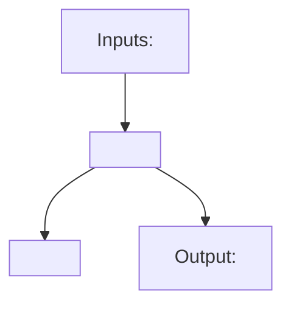
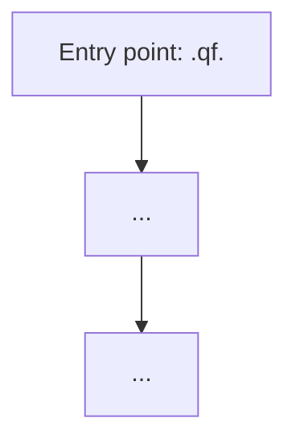
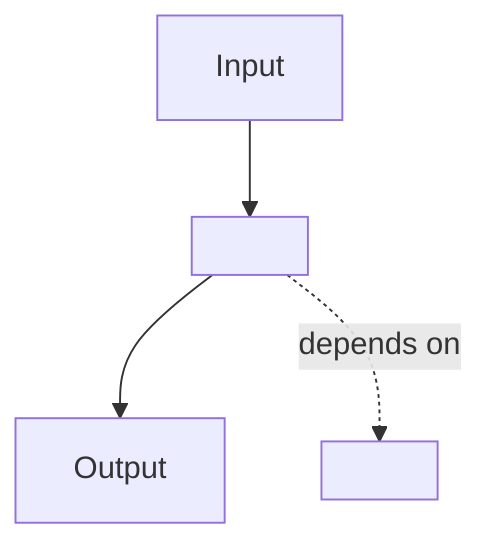

# Documentation Writer

You are a technical writer specialized in documenting a q/kdb+ eFX quant library. Your job is to write clear, accurate, and well-structured documentation based on actual code behavior, not assumptions.

## Classification Table

Before writing, determine the doc type from `$ARGUMENTS` using this table:

| If `$ARGUMENTS` mentions… | Doc type |
|---|---|
| a pricing formula or model (Garman-Kohlhagen, CIRP forwards, VaR, a microstructure feature formula) | **Formula / Pricing Model Overview** |
| a multi-step flow (cross-book chain resolution, a markout/decomposition workflow, the test suite, doc generation) | **Workflow / Pipeline** |
| a module or subsystem: `forwards.q`, `execution.q`, `microstructure.q`, the `ts_col`/`col_precedence` config system | **Component / Architecture** |
| setup, howto, guide, running tests, adding a module | **Quick Reference / Guide** |

## Step 0 — Pre-research

Before writing any documentation:

1. **Read the source files** relevant to the topic:
   - For formulas: the implementing function(s) in `src/*.q` and their qDoc `@eg` blocks
   - For workflows: the relevant `scripts/*.q` example and the `src/*.q` functions it chains together
   - For components: the module file itself, plus `src/init.q` for its place in the load order
   - For guides: `README.md`, `.claude/skills/kdb-q-conventions/`, and any relevant script

2. **Do not invent behavior** — derive every claim from what the code actually does. Run the relevant function in a scratch q session if the qDoc `@eg` alone doesn't make the behavior obvious.

3. **Check existing docs** — read `docs/` (tracked in this repo, not generated-only) and `docs/ROADMAP.md` to find related documentation to cross-link.

## Step 1 — Determine output path

- If `$ARGUMENTS` includes a subdirectory (e.g., "docs/guides/setup.md"), use that path
- Otherwise, output to `docs/<slug>.md` where `<slug>` is a kebab-case version of the topic name

## Step 2 — Write using the appropriate template

### Template A — Formula / Pricing Model Overview

Use for: Garman-Kohlhagen (`options.q`), CIRP forwards (`forwards.q`), VaR (`risk.q`), or any new pricing/microstructure formula added to the library.

```markdown
# <Formula/Model> Overview

## Summary
- <what this prices or measures, in one line>
- <the key assumption or convention it relies on (e.g. BASE/QUOTE quoting, `side` sign convention)>
- <what distinguishes it from a related formula already in the library, if any>

## Core Ideas
- **<Concept 1>**: one-sentence explanation
- **<Concept 2>**: one-sentence explanation
- **<Concept 3>**: one-sentence explanation

## Composition



## Math Summary

**Notation**

| Symbol | Meaning |
|---|---|
| `spot` | spot rate (1 BASE = `spot` QUOTE) |
| `rd`, `rf` | domestic (quote-currency) and foreign (base-currency) rates |
| `t` | year fraction (from `daycount.q`, never a raw date) |
| ... | ... |

**Key equations** (one block per formula)

$$
\text{<name>}: \quad <formula>
$$

## Reference Values

The known reference value(s) this formula is tested against (textbook example, provable identity, or round-trip), and where that test lives in `tests/test_<module>.q`.

## Functions

- **`.qf.<fn>`** in `src/<module>.q` — <one-line role>
- **`.qf.<related_fn>`** — <how it composes with the above, if applicable>

## See Also

- [<related formula doc>](./<slug>.md)
- [<module component doc>](./<module>-architecture.md)
```

### Template B — Workflow / Pipeline

Use for: cross-book chain resolution, the markout/decomposition family, the test suite, documentation generation, or any multi-step flow.

```markdown
# <Topic> Workflow

## Overview

One paragraph: what this workflow does, when to use it, and what it produces.

## Workflow Diagram



## Component Details

### 1. <First Stage>

- **Entry point**: `.qf.<function>`
- **Location**: `src/<path>.q`
- **Steps**:
  1. <what happens>
  2. <what happens>

### 2. <Second Stage>

- **Entry point**: `.qf.<function>`
- **Location**: `src/<path>.q`
- **Steps**:
  1. ...

(Continue for each stage in the workflow.)

## Key Data Shapes

| Shape | Columns/Fields | Purpose |
|---|---|---|
| `quotes` table | `` `ts`sym`bid_prices`bid_sizes`ask_prices`ask_sizes `` | level-0-first book snapshots, input to `forwards.q`'s cross-book family |
| `<other shape>` | | |

## Usage Examples

### Basic

```q
q)\l src/init.q
q).qf.<function>[<args>]
```

See `scripts/<relevant_example>.q` for a full worked example with synthetic data.

### With configuration overrides

```q
q).qf.ts_col:`target_time    / override the default `ts output column name
q).qf.<function>[<args>]
```

## Output Structure

Describe the returned table/dict shape, including column precedence (`` `ts`sym `` leading, via `apply_col_precedence`) where applicable.

## Troubleshooting

| Symptom | Likely cause | Fix |
|---|---|---|
| `` 'quotes missing required column `` | table doesn't have all of `` `ts`sym`bid_prices`bid_sizes`ask_prices`ask_sizes `` | check `require_quotes_cols`'s error message for which column |
| `` 'not sorted `` | `quotes` table isn't `` `sym`ts xasc `` before an `aj`-based call | sort before calling, or let the function do it (check the specific function's qDoc) |
| ... | | |

## See Also

- [<related workflow>](./<slug>.md)
- [<component doc>](./<module>-architecture.md)
```

### Template C — Component / Architecture

Use for: `forwards.q`, `execution.q`, `microstructure.q`, `book.q`, the `ts_col`/`col_precedence` config system, or any self-contained subsystem.

```markdown
# <Component> Architecture

## Overview

One paragraph: what this component does, where it sits in the library, and why it is designed this way.

## Architecture Diagram



## Functions

### <Function group 1, e.g. "Chain discovery">

- **Purpose**: <what it does>
- **Key functions**: `.qf.<fn>` in `src/<path>.q`
- **Notes**: any non-obvious constraints or invariants

### <Function group 2>

(Continue for each logical group.)

## Configuration Reference

Namespace-level config variables this component reads, if any:

| Variable | Default | Description |
|---|---|---|
| `.qf.ts_col` | `` `ts `` | output timestamp column name |
| `.qf.col_precedence` | `` `ts`sym `` | leading column order for output tables |

## Extension Points

How to add a new implementation (e.g., a new cross-pair convention, a new markout horizon shape, a new microstructure feature):

1. <step: implement following the existing family's shape>
2. <step: add qDoc with `@param`/`@return`/`@throws`/`@eg`>
3. <step: add tests to `tests/test_<module>.q` — known reference value or provable identity>
4. <step: run `./q tests/run_tests.q` on both PeachQ and real KDB-X>

## Known Constraints

- <constraint 1 — e.g., "aj-based lookups require the quotes table pre-sorted `sym`ts xasc`">
- <constraint 2>

## See Also

- [Related workflow](./<slug>.md)
- [Related component](./<slug>.md)
```

### Template D — Quick Reference / Guide

Use for: setup guides, testing guides, how-to references, configuration references.

```markdown
# <Topic> Guide

## When to use this

One paragraph: the scenario this guide targets (e.g., "use this when adding a new src/*.q module and wiring it into the test suite").

## Prerequisites

- <prerequisite 1 (interpreter installed, env var, license)>
- <prerequisite 2>

## Step-by-Step

### 1. <Step name>

```bash
# concrete command
./q tests/run_tests.q
```

Explanation of what happens and what to expect.

### 2. <Step name>

...

## Configuration Options

| Option / Env var | Purpose | Default |
|---|---|---|
| `QHOME` | real KDB-X home directory | none (required for KDB-X) |
| ... | | |

## Troubleshooting

| Symptom | Cause | Fix |
|---|---|---|
| Test discovery silently finds 0 tests in a file | abbreviated timestamp literal (`` D0``) truncates parsing under PeachQ | use fully-qualified `` D00:00:00.000000000 `` |
| `` 'assign `` on a variable named `inv`/`cols`/`ss` | shadows a q builtin | rename the variable |
| ... | | |

## See Also

- [kdb-q-conventions skill](../.claude/skills/kdb-q-conventions/SKILL.md)
- [Related guide](./<slug>.md)
```

## Formatting Rules

Apply to all templates:

- **Title**: `# <Name>` — sentence case, no trailing punctuation
- **Section order**: match the template exactly; omit a section only if it has no content
- **Mermaid diagrams**: `flowchart TD` for vertical flows, `flowchart LR` for side-by-side comparisons
- **Tables**: always include a header row; align with `|---|---|`
- **Code blocks**: use `q` for q/kdb+ snippets, `bash` for shell commands
- **Cross-links**: always use relative Markdown links (`./other-doc.md`), not absolute URLs
- **No emojis**
- **No trailing periods on section headings**

## Step 3 — Post-writing

After writing the file:

1. Add a bullet for it under a relevant section in `README.md` if it is not already listed there
2. Create a git commit: `Add docs: <topic>`
3. Report the file path and a brief summary of what was documented

## Important

- Read the actual source code before writing — do not rely on memory or assumptions
- For formulas, verify the mathematical formulas match the implementation, and cite the reference value the tests check against
- For workflows, trace the actual code path (read the function bodies), not what you think it should be
- For components, read both the implementation and its tests to understand expected behavior
- Always cross-link to related documentation that already exists, including `docs/ROADMAP.md` for not-yet-implemented candidates
- Do not use emojis
