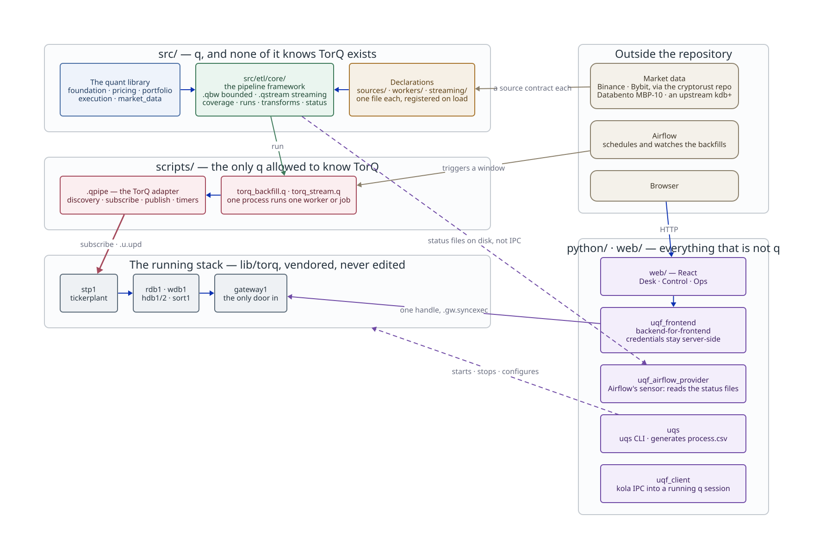

# Documentation map

## System overview

<!-- Source: docs/diagrams/repo-overview.d2. Rendered by
     scripts/generate/render_diagrams.py; edit the .d2 and re-render, never the
     .svg. Its --check only compares where the pinned d2 is installed, which CI
     is not. -->

Read it in two columns. The left is the pipeline, top to bottom: a declaration
in `src/etl/` names a source, a worker or a streaming job; the framework in
`src/etl/core/` runs it; a script in `scripts/` puts it on the tickerplant. The
right is everything that talks to that pipeline without being part of it.

The line worth knowing is the one between the first two bands. **No q file under
`src/` knows TorQ exists** --- that is what lets a worker be tested against a
recorder instead of a tickerplant --- and exactly one namespace is allowed to,
`.qpipe` in `scripts/`. `scripts/gates/check_etl_layering.py` fails the build if
anything under `src/etl/` reaches for it.

For the *running* stack --- who connects to whom --- see
[`architecture/stack.md`](architecture/stack.md), and for ports the generated
[`reference/processes.md`](reference/processes.md); this diagram deliberately
stops at the shape.

## Where a document goes

Five directories, one question each. The rule is what a document *is for*, not
what it is about --- a page about the ETL framework can be a guide, a reference
or an architecture note, and only its purpose decides where it goes.

  | Directory                                 | Answers                                                   | Audience                                 | Pages                                                                                                                                                                                                                                                                                                                                                                                                                                                                                                                                                                                                                                                                                        |
  | ---                                       | ---                                                       | ---                                      | ---                                                                                                                                                                                                                                                                                                                                                                                                                                                                                                                                                                                                                                                                                          |
  | [`guides/`](guides/README.md)             | *How do I do this?*                                       | operators and new developers             | [`uqs.md`](guides/uqs.md) running the stack [`new-pipeline.md`](guides/new-pipeline.md) adding a pipeline, end to end [`ci.md`](guides/ci.md) the gates, run locally [`config-audit.md`](guides/config-audit.md) who changed runtime config [`metatables.md`](guides/metatables.md) partition profiling                                                                                                                                                                                                                                                                                                                                                                          |
  | [`scaffolding/`](scaffolding/README.md)   | *How do I create one of these?*                           | developers adding a process              | one per `uqs new-job` shape: [`feed.md`](scaffolding/feed.md), [`etl.md`](scaffolding/etl.md), [`normalizer.md`](scaffolding/normalizer.md), [`backfill.md`](scaffolding/backfill.md)                                                                                                                                                                                                                                                                                                                                                                                                                                                                                                        |
  | [`services/`](services/README.md)         | *What does this running service do, and how do I run it?* | operators and developers of that service | one per service: [`synthetic-feeds.md`](services/synthetic-feeds.md), [`superbook.md`](services/superbook.md), [`cross-arbitrage.md`](services/cross-arbitrage.md), [`fx-positions.md`](services/fx-positions.md), [`databento.md`](services/databento.md), [`crypto-recorder.md`](services/crypto-recorder.md), [`tap.md`](services/tap.md)                                                                                                                                                                                                                                                                                                                                                 |
  | [`architecture/`](architecture/README.md) | *Why is it shaped this way?*                              | developers changing it                   | [`pipeline-philosophy.md`](architecture/pipeline-philosophy.md) what `src/etl/` is built on [`event-tape.md`](architecture/event-tape.md) the order/trade event tape [`cryptorust-discovery.md`](architecture/cryptorust-discovery.md) a client that never listens [`pipeline-architecture-example.md`](architecture/pipeline-architecture-example.md) a desk system, composed [`stack.md`](architecture/stack.md) the running stack and how it is wired                                                                                                                                                                                                                         |
  | [`reference/`](reference/README.md)       | *What is the contract?*                                   | anyone integrating, and CI               | [`quant-modules.md`](reference/quant-modules.md) each `src/` module [`environment.md`](reference/environment.md) every variable, gated [`pipeline-declarations.md`](reference/pipeline-declarations.md) every pipeline declaration key, gated [`processes.md`](reference/processes.md) every process, its port and edges, generated [`surfaces/current/`](reference/surfaces/current/) the exported contract surface, generated                                                                                                                                                                                                                                                  |

### Also in `docs/`

- [`man.q`](man.q) --- the function registry, generated from the qDoc comments
  under `src/` by `scripts/generate/generate_man_registry.py`. CI fails when it
  is out of date.
- [`presentation/`](presentation/uqf.qmd) --- a short Quarto deck, mostly these
  diagrams, on how uqf differs from running TorQ directly. Render it with
  `quarto render docs/presentation/uqf.qmd`; the HTML is not committed.
- [`diagrams/`](diagrams/) --- the d2 source of every diagram in these pages and
  its rendered SVG, each embedded in the page it illustrates.
  `scripts/generate/render_diagrams.py --check` reports an SVG that no longer
  matches its source, but only where the pinned d2 version is installed; CI has
  no d2, so there it skips.
