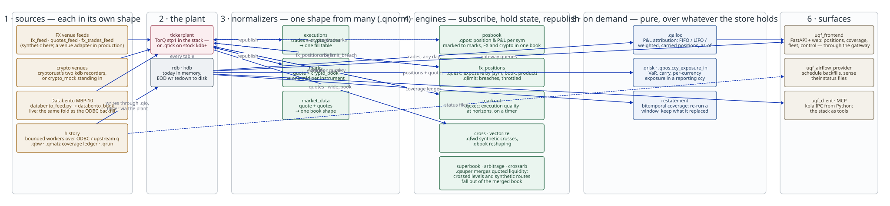

# An example architecture, composed from what is here

What a trading desk's system looks like when it is built out of the services
this tree implements. Not the running demo — [the stack pages](../integrations/torq/README.md)
draw that, with ports — but the *shape*, so that the pieces can be seen as
one system rather than as a list of files.

Read it left to right. Everything to the left of the normalizers arrives in
its own market's format; everything to the right sees one. Every engine reads
from the plant and republishes onto it, so a new engine is a subscriber and
never a change to a producer. Dashed boxes are in an open pull request rather
than on master.

## 1 · Sources

Four kinds of thing put rows on the plant, and they are deliberately not
alike:

| Source | Implemented by | Shape it arrives in |
|---|---|---|
| FX venue feeds | [`fx_feed`](../../src/etl/streaming/fx_feed.q), [`quotes_feed`](../../src/etl/streaming/quotes_feed.q), [`fx_trades_feed`](../../src/etl/streaming/fx_trades_feed.q) — synthetic here, a venue adapter in production | `quote` (one bid, one ask), `trades` (sym, side, price, size, pip_factor) |
| Crypto venues | cryptorust's two kdb recorders, or [`crypto_mock`](../../src/etl/streaming/crypto_mock.q) standing in | `crypto_book` (a ladder per venue), `crypto_trades` (venue, fee, exchange id) |
| Databento MBP-10 | [`external/databento_feed.py`](../../python/uqs/src/uqs/external/databento_feed.py) → [`databento_book`](../../src/etl/streaming/databento_book.q) | raw MBP-10, folded by the same `.qxf` transform the ODBC backfill applies |
| History | bounded workers under [`src/etl/workers/`](../../src/etl/workers), run by [`.qbw`](../../src/etl/core/bounded_worker.q) | whatever the upstream holds, written through `.qio` — never via the plant |

The last row is the one to notice. A backfill writes into storage directly
and records what it covered in the [coverage ledger](../../src/etl/core/materialisation.q),
bitemporally. It never traverses the tickerplant, which is why the two halves
of the ETL tree look alike in the code and take different paths in the
diagram.

## 2 · The plant

One tickerplant, every table. In the stack it is TorQ's `stp1`; on stock
kdb+ it is [`.qtick`](../../src/etl/core/tick.q). The jobs do not
know which — they call `publish` in their own namespace and a runner wires
it — and the three invariants a job must respect are the same on both:

1. the **plant** stamps `time`, never the publisher;
2. keyed tables are refused, because a plant appends;
3. the row count comes from column length, so every column is a list.

`rdb1` holds the day, `hdb1` holds what the EOD wrote down.

## 3 · Normalizers

The narrow waist. [`.qnorm`](../../src/etl/core/normalizer.q) is a job kind
whose instances take several tables carrying the same fact in different
shapes and publish one canonical table, with one declared `.qxf` transform
per source — refused at load if its output drifts from the canonical schema.

| Normalizer | Sources | Output |
|---|---|---|
| [`executions`](../../src/etl/streaming/executions.q) | `trades`, `crypto_trades` | one fill table: source_time, sym, venue, side, size, price, fee, fee_ccy, fill_id |
| [`marks`](../../src/etl/streaming/marks.q) | `quote`, `crypto_book` | one mid per instrument: source_time, sym, venue, mid |

A third market — a new venue, a futures feed — is a mapping in one of these,
not a change to anything downstream.

## 4 · Engines

Subscribe, hold state, republish. Each is one file under
[`src/etl/streaming/`](../../src/etl/streaming), TorQ-free, run by a generic
runner.

| Engine | Reads | Holds | Publishes |
|---|---|---|---|
| [`posbook`](../../src/etl/streaming/posbook.q) | `executions`, `marks` | a [`.qpos`](../../src/portfolio/positions.q) book: position and P&L per sym, weighted-average cost | `position` — FX and crypto in one book |
| [`fx_positions`](../../src/etl/streaming/fx_positions.q) | `orders` | a `.qdesk` book: net exposure by (sym, book, product); `.qlimit` caps | `fx_position` snapshots, `fx_limit_breach` throttled alerts |
| [`markout`](../../src/etl/streaming/markout.q) | `trades`, `quote` | buffered fills awaiting their horizons | `execution_quality` |
| [`cross`](../../src/etl/streaming/cross.q), [`vectorize`](../../src/etl/streaming/vectorize.q) | `quotes`, `wide_book` | mirrors | synthetic crosses; a reshaped book |

`posbook` and `fx_positions` answer different questions and are deliberately
two engines: *what did we make*, per sym, marked; and *what are we holding*,
along the dimensions a desk reports on, with no marks.
[`fx-positions-service.md`](fx-positions-service.md) argues why one module
cannot honestly do both.

## 5 · On demand

Pure functions over whatever the store holds — no state, no clock, no
sockets — called from a query, a notebook or a surface.

- [`.qalloc`](../../src/portfolio/allocation.q) — P&L attribution: which
  opening trade paid for which close, under FIFO, LIFO, HIFO or weighted
  average; carried-in positions; the book as of any instant.
- [`.qrisk`](../../src/portfolio/risk.q), [`.qpos.ccy_exposure_in`](../../src/portfolio/positions.q)
  — VaR, carry, and per-currency exposure revalued into one reporting
  currency through [`.qfwd`](../../src/pricing/forwards.q)'s cross-rate
  chaining.
- Restatement — the coverage ledger is bitemporal, so a window can be
  re-run and the answer it replaced is still there. [The design note](restatement-design.md)
  is the argument; `.qmatz` is the implementation.

## 6 · Surfaces

- [`uqf_frontend`](../../python/uqf_frontend) — FastAPI and a web app:
  positions, coverage, the fleet, and a control view that can start the
  stack. Every query goes through the gateway, never to a process directly.
- [`uqf_airflow_provider`](../../python/uqf_airflow_provider) — an operator
  that starts a backfill and a sensor that reads the status files
  [`.qstatus`](../../src/etl/core/status.q) writes.
- [`uqf_client`](../../python/uqf_client) and the MCP server — kola IPC from
  Python, and the stack as tools an agent can call.

## What a day looks like through it

A fill on Binance reaches `crypto_trades` from the recorder; `executions`
spells it the way an FX fill is spelled; `posbook` folds it into the same book
the EURUSD position lives in and marks it to the mid `marks` last saw from the
Binance ladder. The frontend's position view shows both, through the gateway.
At the end of the day `.qalloc` says which of the morning's buys that
afternoon's sell actually closed, under whichever convention the desk
reports in — and if a venue's history has to be re-run, the backfill writes
the corrected window beside the old one, and the ledger says which is
which.

None of that required a producer to know about a consumer.
