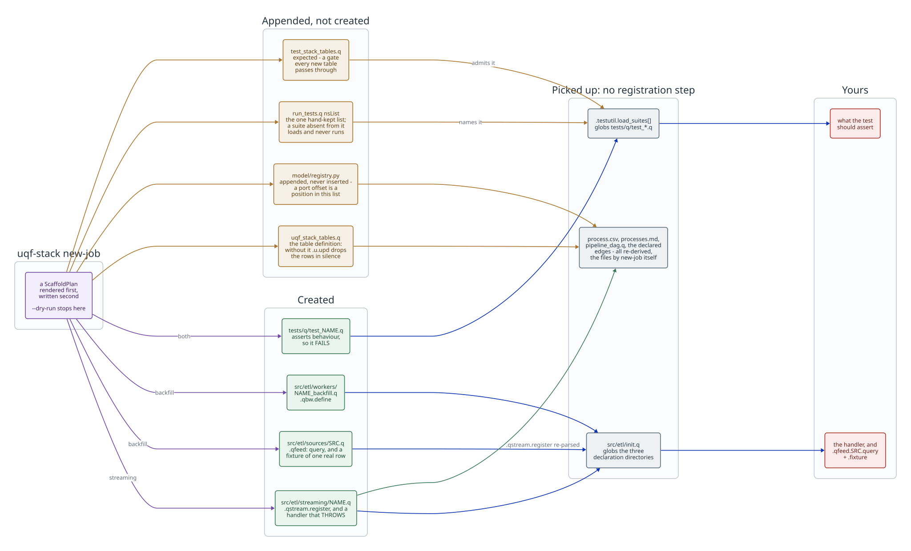

# Adding a data pipeline

How to take an external source of rows and land it in a local table, with
completeness you can query and a bound you can see. The worked example below
is a real one: every command was run against this tree, and the output shown
is what it printed.

A pipeline here is **three declarations**, and nothing that registers them.
The lifecycle — windowing, retries, coverage, checkpoints, dry-run, the job
graph — is the shell's, and you do not write any of it. If you find yourself
writing a loop over days, you are rebuilding `.qbw`.

| You write | It says |
|---|---|
| a **source** in `src/etl/sources/` | what the rows are, where they come from, how to window them |
| a **transform**, beside the worker | what a fetched batch becomes before it is published, with example tables |
| a **worker** in `src/etl/workers/` | which source, which transform, which target dataset, how wide a window |

[`src/etl/init.q`](../../src/etl/init.q) **globs** those three directories, so
there is no fourth row: a declaration loads because its file exists. It used
to be a `\l` line per file — twenty-six of them, a hand-kept copy of `ls`
whose failure mode was a file nobody loaded.

Everything else follows from those. Why it is shaped this way is
[the pipeline philosophy](../architecture/pipeline-philosophy.md); what the
framework guarantees is [ETL-nn](../reference/etl-framework-requirements.md).

## Scaffolding it

`uqf-stack new-job` writes the skeleton: the q files, the table definition,
the registry entry and a test.

<!-- Source: docs/diagrams/scaffolding.d2. Rendered by
     scripts/generate/render_diagrams.py, which CI runs with --check. -->



Read it left to right. The **appends** are the whole reason the middle band
exists: everything else is picked up by a glob, and those files hold the facts
the tree cannot derive from itself — the table definition, a process's port
offset, which is its position in the registry list, `nsList`, the one
hand-kept list of test namespaces, and `expected` in
[`tests/q/test_stack_tables.q`](../../tests/q/test_stack_tables.q), the gate
every new table passes through. After writing them, `new-job` reruns
`scripts/generate/generate_operational_docs.py`, so `processes.md` and
`src/etl/generated/pipeline_dag.q` never lag the registry it just changed.

```
uqf-stack new-job markout2 --subscribes trades,quote \
    --publishes my_metric --columns "sym:symbol, value:float"

uqf-stack new-job fx_rates --kind backfill --dataset fx_rates \
    --columns "sym:symbol, mid:float" --width 1D
```

`--dry-run` prints what it would write and writes nothing. `kind` is derived
for a streaming job - one that subscribes to nothing is a feed - and the
registry entry is APPENDED, because offsets are allocated in list order and
inserting above an existing entry renumbers every process after it.

**It writes the shape, never the logic.** The generated handler throws and
the generated test fails, on purpose: a scaffold that left something green
behind would make "generated" and "implemented" look the same from outside,
which is how you get a process that is `up`, heartbeating, and publishing
nothing.

The one place it does NOT leave a throw is a source's `fixture`, which the
worker's `.qxf.passthrough` reads at LOAD time - a throw there stops the
whole ETL tree from loading, and an empty table is refused by `.qxf.define`,
which needs at least one example with rows. So it writes one deterministic
row of the declared shape. Replace it before trusting a run.

### What a fresh scaffold leaves red

The generated handler throws and the generated test fails, and that is the
one q failure you see:

```
$ uqf-stack new-job dxprobe --subscribes trades --publishes dx_t --columns "sym:symbol, v:float"
$ q tests/run_tests.q
  .dxprobetest.test_dxprobe_is_implemented
```

Nothing else in the q suite needs an edit. `test_every_job_is_registered`
derives its jobs from `src/etl/streaming/` (#352), and the scaffold adds a
new table to `expected` in `test_stack_tables.q`. That list stays a
**deliberate gate** — a new table is either a capability nobody wired up or a
stray definition — and the scaffold passes it by defining the table and
naming its owner in the same plan. It also registers your test's NAMESPACE in
`run_tests.q` (#350); without that the stub loaded and never ran, so the one
red the scaffold exists to leave was the one you could not see.

`uv run pytest python/` fails once too, and that one is yours to write:
`test_the_prose_architecture_doc_is_consistent_with_the_registry` asks that
[`docs/integrations/torq/README.md`](../integrations/torq/README.md) name the
new process. It is authored prose, so no generator can write it for you.

The rest of this guide is what to write into that skeleton, and why each
part is shaped the way it is.

## Before you start: is it bounded or continuous?

Two different shells, and picking the wrong one is the only structural
mistake here that is expensive to undo.

**Bounded** — you know the range before you start: a backfill, a nightly
window, a restatement. It runs, it finishes, it exits. `.qbw`, and the rest
of this guide.

**Continuous** — it subscribes and never finishes: a tickerplant feed, a
poller. `.qcont` in [`src/etl/core/continuous_state.q`](../../src/etl/core/continuous_state.q),
whose state is a cursor rather than a range.

Both have a transform, and both are **one file per job**. A continuous job
is a file under [`src/etl/streaming/`](../../src/etl/streaming) holding every
step — schemas, transform, batch handler, timer body, its own buffers — and a
`.qstream.register` call naming the tables it subscribes to, the tables it
publishes and the TorQ process that runs it. A **feed** is the same thing
with no subscription: it declares a `timer_period` and an `on_timer` that
builds rows and publishes them. One generic process script,
[`scripts/processes/torq_stream.q`](../../scripts/processes/torq_stream.q), runs whichever job
the process it was started as claims.

A job never calls TorQ: it calls `publish` in its own namespace, which the
runner wires to the tickerplant and a test wires to a recorder
(`tests/q/test_stream_job.q`). That seam is what lets the whole job — not
just its transform — be loaded and driven in a plain q process.

**Every table you publish must exist on the plant.** `.u.upd` onto a table
the tickerplant does not define discards the rows *silently* — no error, no
warning, just a table that stays empty while the job reports healthy. This
is not hypothetical: `fxpositions1` published a correct sixteen-row book
onto `fx_position` and `fx_limit_breach` every five seconds, and neither
table existed. `database.q` is generated from each pipeline's `publishes`
rather than from a single `schema` field, precisely because a job can
publish two tables and own neither, and `.qpipe.assert_publishable` makes a
process refuse to start when the plant has no table for something it
declares. So the failure is now loud at startup instead of silent forever —
but only for what the job *declares*, which is one more reason the register
call has to name every table the job actually publishes.

**Normalizer** — a continuous job of one particular shape: several tables
carrying the same fact in different spellings, one canonical table out.
`.qnorm` in [`src/etl/core/normalizer.q`](../../src/etl/core/normalizer.q).
An instance declares its output and one `.qxf` transform per source, and
the shell owns the rest — it dispatches on the table a batch arrived on,
projects the batch onto the columns that source's transform declares,
applies it, and publishes. It also performs the `.qstream.register` itself,
so the job's edges cannot disagree with its mappings, and it refuses at
`define` any mapping whose declared output drifts from the canonical table,
column, type and order. Two ship: `executions` (`trades` + `crypto_trades`)
and `marks` (`quote` + `crypto_book`), which is how `posbook1` holds FX and
crypto positions in one book without knowing either market's tape format.
A third market is a mapping in a normalizer, not a branch in a consumer.

```q
.qnorm.define[`executions;`procname`output`sources!(
    `executions1;
    .qsub.executions.executions;
    `trades`crypto_trades!`executions_from_trades`executions_from_crypto_trades)];
```

The rest of this guide is the bounded case.

## 1. Declare the source

A source declares its **shape**, not its plumbing. Create
`src/etl/sources/fx_rates.q`:

```q
/ fx_rates.q - an external reference-rate source (.qfeed.fx_rates).

\d .qfeed.fx_rates

source_name:`fx_rates
fields:`rate_time`sym`mid     / the columns this adapter reads
types:"psf"                    / one q type character per field
target:`fx_rates               / the local table they land in
time_field:`rate_time          / the column the window is taken on
row_key:`rate_time`sym         / what identifies a row uniquely
tz:`UTC                        / what time_field is expressed in

query:{[h;range_from;range_to]
    h({[from_ts;to_ts]
        select rate_time, sym, mid from `fx_rates
            where rate_time>=from_ts, rate_time<to_ts
      };range_from;range_to)}

fixture:{[]
    ([] rate_time:2026.09.11D09:00:00.000000000+1D*til 5;
        sym:`EURUSD`GBPUSD`EURUSD`USDJPY`EURUSD;
        mid:1.0842 1.2631 1.0847 149.82 1.0851)}

.qsrc.register[source_name;
    `source`table`target`time_field`row_key`fields`types`query`fixture`tz!
    (source_name;`fx_rates;target;time_field;row_key;fields;types;query;fixture;tz)];

\d .
```

Five of those deserve a sentence each, because each is a decision rather
than a formality.

**The namespace is `.qfeed.<source name>`, and it is the same word twice.**
Sources live under one `.qfeed` root and are named exactly as they register,
so `\d .qfeed.fx_rates` goes with `source_name:`fx_rates` and nothing else —
`test_source_contract.q` reads every file under `src/etl/sources/` and fails
if the two disagree. Before the root, the namespace was an abbreviation
(`.qsdemo` for `demo_deals`) that no check compared with anything. Workers
do the same thing under `.qwrk`.

**`fields` is what you READ, not everything the source has.** Declaring a
column the worker never touches means an upstream change to an unused column
breaks the run.

**`query` is a parameterised lambda, never string concatenation.** The bounds
are arguments to a functional select evaluated on the remote side, so no
caller value is ever spliced into query text. `"select ... where t>=",string
range_from` is how a crafted value becomes an injection, and how a type
coercion becomes a silently wrong window rather than an error. Where a driver
cannot parameterise — ODBC — there is exactly one escape function,
`.qodbc.literal`, and everything goes through it.

**The window is half-open `[from;to)`** — `>=` on the lower bound and `<` on
the upper. One wrong operator double-publishes every boundary row, and the
duplicate surfaces far from here.

**`row_key` is only correct if the source guarantees uniqueness.** A source
that reuses ids after a purge silently merges unrelated rows. It is declared
per source for that reason; see
[the restatement design](../architecture/restatement-design.md).

**`tz` is a claim, not a default.** An unstated zone is the shape of
the bug: every later reader assumes UTC while the source hands over local
wall-clock time, and the two differ by an offset that changes twice a year.
`UTC` is the only value needing no zone table — push the conversion upstream
if you can.

**`fixture` must satisfy the same contract as the live source**, and it must
be deterministic. A fixture that changes between runs makes a failing
assertion impossible to attribute. It is what the worker uses when no
credential is configured, which is a stated demo path rather than a fallback
for a failed connection — an outage must never quietly become synthetic data
recorded as covered.

## 2. Write the worker

Mostly a declaration. Create `src/etl/workers/fx_rates_backfill.q`:

```q
/ fx_rates_backfill.q - the fx_rates bounded worker (.qwrk.fx_rates_backfill).

\d .qwrk.fx_rates_backfill

/ Refuse a batch that is shaped correctly but cannot be true.
quality_check:{[batch]
    if[0=count batch; :.qbw.no_failures[]];
    bad:select from batch where not mid>0;
    $[0=count bad;
      .qbw.no_failures[];
      ([] check:enlist `positive_mid;
          status:enlist `fail;
          detail:enlist "non-positive mid on ",string[count bad]," row(s)")]}

\d .

/ The transform: fetched rows in, published rows out, and an example of each.
.qxf.define[`fx_rates_pips;`inputs`output`fn`examples!(
    enlist[`batch]!enlist ([] rate_time:`timestamp$(); sym:`symbol$(); mid:`float$());
    ([] rate_time:`timestamp$(); sym:`symbol$(); mid:`float$(); pip_factor:`long$());
    {[batch] update pip_factor:?[sym like "*JPY";100;10000] from batch};
    enlist `inputs`expected!(
        enlist[`batch]!enlist ([] rate_time:2026.09.11D09:00 2026.09.12D09:00; sym:`EURUSD`USDJPY; mid:1.0842 149.82);
        ([] rate_time:2026.09.11D09:00 2026.09.12D09:00; sym:`EURUSD`USDJPY; mid:1.0842 149.82; pip_factor:10000 100)))];

.qbw.define[`fx_rates_backfill;
    `source`dataset`width`transform`check!
    (`fx_rates;`fx_rates;1D;`fx_rates_pips;.qwrk.fx_rates_backfill.quality_check)];
```

**The namespace is `.qwrk.<worker name>`, and you do not choose it.** Every
worker instance lives under the one `.qwrk` root, named exactly as it is
registered, and `.qbw.define` derives the namespace from the worker name —
a supplied `ns` key is refused. So `key `.qwrk` lists every loaded worker,
and a worker has one name rather than a name and an abbreviation to keep in
step. The library's own modules stay flat (`.qbw`, `.qmatz`, `.qsrc`); the
nesting marks the line between the framework and what runs on it.

**The contract's names are stamped by `define`, not written by you.**
ETL-01 requires `source_version`, `range_from` and `range_to` to be names in
*this* namespace, so that "is this worker complete" is a check rather than a
code-review question — and `.qbw.define` writes them there, along with
`handle`, the run accumulators, and the eight methods
(`init`, `plan`, `fetch`, `publish`, `checkpoint`, `spec`, `run`, `cleanup`),
each a one-line delegate to the shell with the shell's own parameter names:

```q
q).qwrk.fx_rates_backfill.fetch
{[from_ts;to_ts] .qbw.fetch[`fx_rates_backfill;from_ts;to_ts]}
```

Until #227 every worker file carried that block by hand. The method list
comes from `.qbfstate.bounded_worker_methods`, so a method added to the
contract reaches every worker without any file being edited.

**To override a method, define it before the `define` call.** `define` fills
only the names the namespace does not already have, and `.qbw.run` reaches
`plan`, `fetch` and `publish` through the worker's namespace rather than
calling its own — so a worker with a genuinely different publish path
writes `publish:{[batch] ...}` above its `define` and the run loop uses it.
An override that wants the default for part of its work calls the shell by
its full name, `.qbw.publish[`fx_rates_backfill;batch]`. Tests should call
an override through `.qwrk.fx_rates_backfill.run[]`, not only directly: the
first version of the shell honoured overrides from the prompt and from
nowhere else.

**`transform` is required, because it is the job.** It runs between fetch and
the check, so the check and the target both see its output. Its one input
must be the source's `fields` and `types` exactly, and `define` refuses a
transform written against any other shape. The expected table is written by
hand: `tests/q/test_transform.q` runs every registered transform's examples on
every build, calls each twice to catch a clock or a random draw in the
output, and feeds each an empty batch. A job that publishes what it fetched
declares `.qxf.passthrough` rather than leaving the step out.

**`check` is optional, and it runs between the transform and publish.** A batch that
fails is never published and its window is never recorded as covered, so the
next run plans it again. Make the conditions ones no correct row could meet —
a non-positive rate, a null key — rather than statistical outliers. A check
that fires on merely unusual data trains its reader to ignore it, and an
ignored check is worse than none because it still reads as protection.

`io` and `facts` are the other optional keys: an
[IO manager](../../src/etl/core/io_manager.q) to write somewhere other than
an in-memory table, and a function from the transformed batch to a dictionary of
labels recorded as materialisation metadata.

## 3. Register it

**Nothing, for the load.** `src/etl/init.q` globs `sources/`, `workers/` and
`streaming/`, so a declaration file is loaded the moment it exists. It used
to list all twenty-six by hand, in the right place.

Two orderings still hold, and the file explains both: directories load
sources before workers, because `.qbw.define` looks its source up at define
time; and within `streaming/` the two jobs that read another job's table at
load time are named in a `lead` list. Add a file that does the same and you
will get a bare `` `.qsub.<name> `` on load — put it in that list.

A test file needs no registration either. `tests/run_tests.q` globs
`tests/q/test_*.q` and derives its namespace list from what actually loaded.
It used to keep two hand-written lists, and forgetting the second one was
silent: the file loaded, its tests never ran, and the suite stayed green.

The job graph adopts the worker from its own declaration:

```q
q).qdag.adopt_workers[];
q).qdag.declaration `fx_rates_backfill
kind   | `bounded
inputs | ,`fx_rates@fx_rates
outputs| ,`fx_rates
```

### Give it a process, or the build fails

One more registration, and it is the one that is easy to miss because
nothing in q needs it. A backfill process and its worker are joined at
*runtime* by `UQF_BACKFILL_WORKER` — one script serves every worker, and the
environment picks which. So a fully declared worker with no process to run it
is invisible to every grep: it looks finished and can only ever be started by
hand. Two workers were adrift exactly this way before the rule existed.

Add a `Pipeline` to `PIPELINES` in
[`model/registry.py`](../../python/uqf_stack/src/uqf_stack/model/registry.py)
naming the worker it runs:

```python
Pipeline(
    procname="fx_rates_backfill1",
    script="processes/torq_backfill.q",
    kind=PipelineKind.BACKFILL,
    worker="fx_rates_backfill",
    startwithall="0",
    note="bounded: reads the vendor's daily fixings over ODBC",
),
```

**A streaming job does not restate its edges here.** Its
`.qstream.register` already names the tables it subscribes to and publishes,
so the entry defers to it:

```python
Pipeline(
    procname="posbook1",
    script=STREAM_RUNNER_SCRIPT,
    kind=PipelineKind.ETL,
    subscribes=FROM_DECLARATION,   # read from posbook.q's own declaration
    table="position",
    schema=POSITION_TABLE_SCHEMA,
),
```

Those fields used to be written twice - once in q, once here - and
`verify_pipeline_edges` existed to check the two agreed. There is one
declaration now, so there is nothing to drift and nothing to check. What
still belongs in the entry is what q has no way to know: the port offset,
whether it starts with the stack, and which table's schema it owns.

`FROM_DECLARATION` is strict. A pipeline that defers and has no matching
`.qstream.register`/`.qnorm.define` **raises** rather than resolving to
nothing - usually because the `procname` in the entry and the one in the q
file disagree. Resolving to empty would drop the job's tables out of the
generated `database.q`, and `.u.upd` onto a table the plant does not define
discards its rows in silence.

A feed that subscribes to nothing keeps `subscribes=()`: there is no second
copy to remove, and `()` says it more plainly than a pointer to a file.

`verify_pipeline_edges` checks this in both directions — a worker no pipeline
names, and a pipeline naming a worker no file declares:

```
fx_rates_backfill: a bounded worker declares itself but no backfill pipeline
names it, so it can only be run by hand. Add a Pipeline with
worker='fx_rates_backfill', or add it to WORKERS_WITHOUT_A_PROCESS with a reason
```

`WORKERS_WITHOUT_A_PROCESS` is empty and meant to stay that way: the publish
seam means the same file runs under either runner, so an entry there claims
"this job cannot be started the normal way", which needs a reason.

`startwithall="0"` is the normal choice for a backfill — it registers with
discovery, runs its range and exits, so starting it with the fleet would run
it on every `uqf-stack start all`.

## 4. Run it

In a q session from the repository root:

```q
\l src/init.q
\l scripts/processes/torq_pipeline.q
\l src/etl/init.q

.qwrk.fx_rates_backfill.init[`source_version`range_from`range_to!(`v1;2026.09.11D00:00;2026.09.16D00:00)];
.qwrk.fx_rates_backfill.run[]
```

`scripts/processes/torq_pipeline.q` is easy to forget and the failure is obscure: it
defines `.qpipe`, which is where the status and lock directories come from,
and without it `init` dies inside `mkdir` on a path built from nothing.

The run reports:

```
state:             completed
windows completed: 5
rows published:    5
rows in target:    5
covered:           1
```

Five daily windows over a five-day range, each published and recorded.

As a process, which is what an orchestrator starts — the worker and its
range come from the environment, because a backfill that guessed a range
would publish the wrong window and record it as covered:

```
UQF_BACKFILL_WORKER=fx_rates_backfill \
UQF_BACKFILL_VERSION=v1 \
UQF_BACKFILL_FROM=2026.09.11D00:00 \
UQF_BACKFILL_TO=2026.09.16D00:00 \
  q scripts/processes/torq_backfill.q
```

## 5. Check what it claims

Coverage is **recorded, not derived** — a completion event is staged for
every completed window, including an empty one. That is what makes "we ran
and there was nothing" distinguishable from "we never ran", and a derived
ledger cannot express the difference at all.

```q
q).qmatz.is_covered[`fx_rates;`;`v1;.z.p;2026.09.11D00:00;2026.09.16D00:00]
1b
```

The `` ` `` is the partition, and it is required on every read for the
reason `source_version` is: an optional filter is one a caller forgets, and
forgetting this one reports a gap-ridden range as complete. `` ` `` means
"this dataset has no partition dimension" — see below.

Run it a second time and it is **idle**, not failed:

```q
q).qwrk.fx_rates_backfill.run[][`state]
`idle
```

"Ran, found no work" is a success. An orchestrator that cannot tell
the two apart retries a successful no-op forever.

`.qmatz.missing` narrows a range to what is still absent, `.qmatz.history`
shows every claim ever made, and `.qmatz.contributing_runs` says which
executions built it.

## 6. Test it

Add `tests/q/test_fx_rates_backfill.q`. The file itself needs no
registration — `tests/run_tests.q` globs `tests/q/test_*.q` — but its
NAMESPACE does: add `.<name>test` to that file's `nsList`. Forgetting it used
to mean the suite loaded your tests and silently never ran them;
`test_the_runner_runs_every_suite_it_loads` now fails instead, naming the
namespace that is missing. Then:

```
scripts/test.py q-unit
```

Worth covering beyond the happy path, because each has bitten this tree:
a second run is idle; a version bump re-runs the whole range; a partial run
is narrowed to the gap; a middle gap is not bridged by a window spanning it;
a contract-breaking source records **no** coverage rather than publishing
nulls; a dry run publishes nothing; and each of the five contract methods
actually delegates.

`scripts/test.py coverage` will tell you which of those you missed.

None of that runs your `query`. The unit suite never sets a credential, so a
worker there runs on its fixture, and the query lambda is never sent
anywhere. To see it run against a real second process, follow
[`tests/q/run_two_instances.q`](../../tests/q/run_two_instances.q): start a
plain q process holding the upstream table, set
`UQF_SOURCE_CRED_<SOURCE>=host:port`, and run the worker (`scripts/test.py
q-two-instances` does exactly this for `upstream_trades`). One trap that only
shows up there: write `` from `trade ``, never `from trade`. The lambda
carries your `\d .qfeed.fx_rates` across the wire, so a bare name resolves
in that namespace on the remote and throws; `test_source_contract.q`
refuses it.

## Recomputing a table when the one it reads is published

A published window announces itself. Register a reaction and it runs, with the
range that was just published, as soon as the window is recorded:

```q
`positions set ([sym:`symbol$(); window:`timestamp$()] notional:`float$());

.qreact.on[`demo_deals;`rebuild_positions;{[ds;range_from;range_to]
    / recompute exactly what changed - the range is handed to you
    `positions upsert select sum notional by sym, window:range_from from
        select from demo_deals where deal_time within (range_from;range_to-1)
    }];
```

Run against the five-day demo range, that fills itself as each window
publishes, with nothing calling it by hand:

```
run:  `state`windows_completed`rows_published!(`completed;5;5)

sym    window                       | notional
------------------------------------| --------
EURUSD 2026.09.11D00:00:00.000000000| 1000000
GBPUSD 2026.09.12D00:00:00.000000000| 2500000
EURUSD 2026.09.13D00:00:00.000000000| 750000
USDJPY 2026.09.14D00:00:00.000000000| 3000000
EURUSD 2026.09.15D00:00:00.000000000| 1250000
```

**Key the derived rows by the window, not only by `sym`.** The handler is
called once per window with that window's range, so a derived row keyed on
`sym` alone is overwritten by the next window rather than added to -
EURUSD's three deals would read as its last one. Keyed by the window each
contribution is stored once, the total is `select sum notional by sym from
positions`, and re-publishing a window replaces its own row instead of
double counting. That last property is what makes a restatement safe.

Nothing polls, and nothing is missed: `.qbw.do_window` fires the event after
`finish_window` records the materialisation, so the reaction sees a ledger
that already includes the window it is being told about. A dry run publishes
nothing and therefore announces nothing.

**Who should react is derivable; what they should do is not.** `.qdag` already
knows which jobs read a dataset — `.qreact.dag_consumers[`demo_deals]` names
them — but running a downstream worker needs a `source_version`, which is a
decision about which release of the upstream data the run claims (ETL-09).
No framework can invent one, so the graph tells you who to wire and the
handler says what running means. `.qreact.audit[]` lists graph edges with no
reaction behind them, and reactions on datasets the graph does not know.

**Three things the dispatcher guarantees**, each because the alternative fails
quietly rather than loudly:

- **A cascade is a loop, not recursion.** A handler that publishes notifies
  from inside the first notification; that work is queued and drained by the
  call already draining. A chain cannot grow the stack.
- **A failing reaction never fails the publication.** The rows are written and
  the coverage staged before any handler runs, so a downstream bug cannot turn
  a successful materialisation into a failed one. Failures land in
  `.qreact.history` and the log.
- **A cascade terminates.** The same `(dataset, range)` is dispatched at most
  once per drain, so `a -> b -> a` settles; `.qreact.max_depth` bounds a chain
  that keeps inventing new ranges.

### Reactions are nodes in the job graph

`.qdag.adopt_all[]` picks up reactions alongside workers, feeders and the
streaming processes, so one graph covers the whole system. A reaction's
**input** is the dataset it watches — that is a fact, it is what fires it.
Its **output** is whatever it declared, and the three ways of registering one
differ in exactly that:

| | Output | In the graph as |
|---|---|---|
| `.qreact.on` | none | a terminal node — reads the dataset, says nothing about what it writes |
| `.qreact.on_writing` | **asserted** by you | a full node, listed in `audit[]``asserted` |
| `.qreact.on_worker` | **derived** from the worker's own declaration | a full node that cannot disagree with what the worker does |

Prefer `on_worker` where it applies: the worker already declares its target
through its source, so nothing is restated and `dag.q`'s "derive, never
re-declare" rule survives. `on_writing` is for a handler that writes
something no worker owns — worth having, because it puts the edge in the
graph, but it is a claim about an opaque lambda rather than a checked fact,
and `.qreact.audit[]` lists those separately so a drawing can mark them.

**The payoff is that a reactive cycle is refused when you wire it**, not when
it runs. Before reactions were in the graph, `a → b → a` survived until the
per-drain guard and `max_depth` stopped it mid-cascade; now:

```
q).qdag.topological[]
'topological: cycle among a~to_b, b~to_a
```

A reaction node is named `<dataset>~<reaction>`, because a reaction name is
unique per dataset rather than globally. Build that name with
`.qdag.reaction_job[dataset;name]` rather than typing it: `~` cannot appear
in a q symbol literal, so `` `demo_deals~rebuild `` parses as a *match*
against a variable called `rebuild` and fails with a value error naming that
variable instead of anything about the graph.

**When a timer is still right.** This answers "recompute because data
arrived". It cannot answer "recompute because time passed" — `markout1` scores
a fill once a quote at its horizon should exist, and no publication event can
tell it that. `.qpipe.safe_timer` remains the tool for that question.

## Filling one dataset with several workers

One worker per `(dataset, partition)` pair. Declare a `partition` and two
workers can fill one dataset at once:

```q
.qbw.define[`fx_rates_eurusd;
    `source`dataset`width`transform`partition!(`fx_rates;`fx_rates;1D;`fx_rates_pips;`EURUSD)];
```

Coverage is then recorded and read under that partition, and **no read unions
across partitions** — a range covered for `` `EURUSD `` says nothing about
`` `USDJPY ``. Declaring nothing gets the `` ` `` sentinel, which behaves
exactly as before the column existed.

Two workers on the same dataset *and* partition are still refused, for the
unchanged reason:

```
define: clash declares dataset fx_rates[EURUSD], already claimed by
fx_rates_eurusd - two workers on one dataset and partition produce coverage
rows nothing can tell apart
```

## What you did not have to write

Windowing, resumption from a checkpoint, skipping what is already published,
retry with backoff that distinguishes transport from data failures, the
dry-run gate, coverage staged only after the publication it describes,
single-instance locking, heartbeats, structured logs, and a node in the job
graph. All of it is `.qbw` and `.qwrt`, and all of it is the same for every
worker — which is the point.
