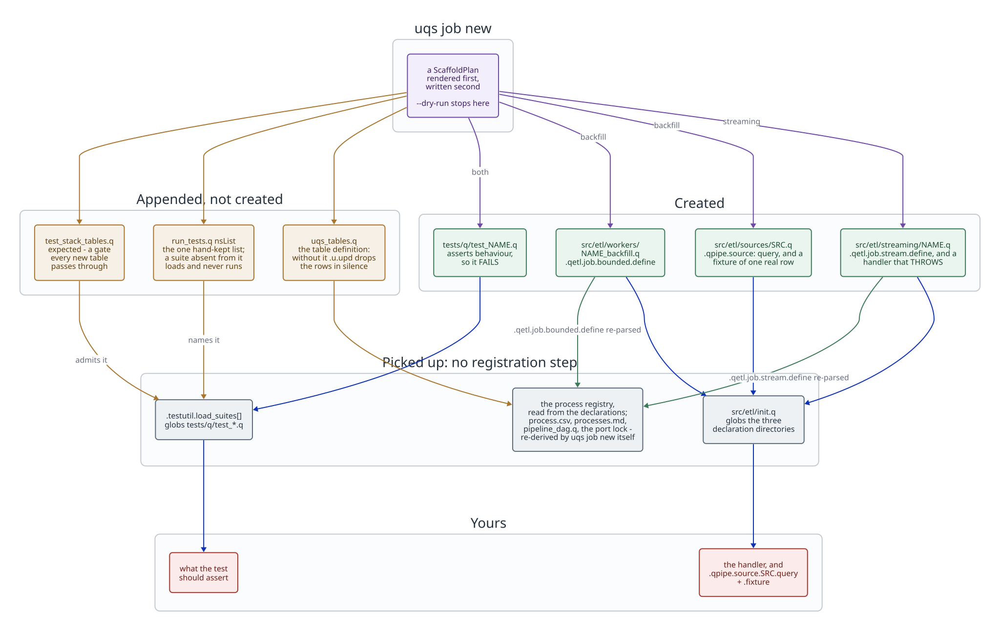

# Adding a data pipeline

How to take an external source of rows and land it in a local table, with
completeness you can query and a bound you can see. The worked example below is
a real one: every command was run against this tree, and the output shown is
what it printed.

A pipeline here is **three declarations**, and nothing that registers them. The
lifecycle --- windowing, retries, coverage, checkpoints, dry-run, the job graph ---
is the shell's, and you do not write any of it. If you find yourself writing a
loop over days, you are rebuilding `.qetl.job.bounded`.

  | You write                          | It says                                                                  |
  | ---                                | ---                                                                      |
  | a **source** in `src/etl/sources/` | what the rows are, where they come from, how to window them              |
  | a **transform**, beside the worker | what a fetched batch becomes before it is published, with example tables |
  | a **worker** in `src/etl/workers/` | which source, which transform, which target dataset, how wide a window   |

[`src/etl/init.q`](../../src/etl/init.q) **globs** `sources/`, `transforms/`,
`workers/` and `streaming/`, so there is no manual loader entry: a declaration
loads because its file exists.

Everything else follows from those. Why it is shaped this way is [the pipeline
philosophy](../architecture/pipeline-philosophy.md). Every key each declaration
accepts, and what it refuses, is in [the declaration
reference](../reference/pipeline-declarations.md).

## Scaffolding it

`uqs job new` writes the skeleton: the q files, the table definition and a test.
There is no registry entry - the process is read from the job's own declaration.

<!-- Source: docs/diagrams/scaffolding.d2. Rendered by
     scripts/generate/render_diagrams.py, which CI runs with --check. -->



Everything but three files is picked up by a glob. Those three it appends to:
the table definition, the test namespace list `nsList`, and `expected` in
[`tests/q/test_stack_tables.q`](../../tests/q/test_stack_tables.q). It then
regenerates `processes.md`, `pipeline_dag.q` and the port lock.

```
uqs job new markout2 --subscribe-to trades,quote \
    --publishes my_metric --columns "sym:symbol, value:float"

uqs job new fx_rates --kind backfill --dataset fx_rates \
    --columns "sym:symbol, mid:float" --width 1D

uqs job new fx_rates_1h --kind backfill --dataset fx_rates_1h \
    --source fx_rates --columns "sym:symbol, mid:float" --width 0D01
```

`--transport odbc` scaffolds a backfill source read from a database instead of a
q process, and `--transport local` one read from an HDB directory's files on
this machine, with no process serving it (see "A source read from local HDB
files" below), `--procname` names the process, and `--start-with-all` puts a
streaming job in `uqs start all`. `--period` sets a feed's tick or gives an etl
a timer, `--profile`/`--unprofiled` place a standing job in a start profile, and
`--partition`/`--check` shape a backfill. `uqs job remove NAME` undoes a
scaffold. Where q is installed, `uqs job new` also re-exports the contract
surface; without it, it prints the command to run.

The third is a second worker over the second's source: an existing source or
table is reused, not rewritten. `--columns` is required whenever a new source or
table is written, and refused otherwise. Two workers cannot fill one dataset
without a partition - see [below](#filling-one-dataset-with-several-workers).

A streaming job follows the same rule for what it publishes: `--publishes` takes
a comma list, a table the plant already defines is published onto without
`--columns`, and `--columns` shapes the one new table. Its `--subscribe-to` must
name tables the plant defines, so a producer is scaffolded before its consumer.

`--dry-run` prints what it would write and writes nothing. `kind` is derived for
a streaming job, and the new process's port is appended to the port lock, so no
existing process moves.

The scaffold itself --- what each shape gets, why the handler throws, and the
one generated body that does *not* throw --- is
[`scaffolding/`](../scaffolding/README.md), a page per shape. This guide picks
up where that leaves off, so what it needs from there is just the list of what a
fresh scaffold leaves red.

### What a fresh scaffold leaves red

The handler throws and the test fails, deliberately. For a job that subscribes
and publishes, its scaffolded test also carries a `contract_driver` that throws
until written - the batch
[`tests/q/test_job_output_contracts.q`](../../tests/q/test_job_output_contracts.q)
drives the job with to hold every table it publishes to its plant table:

```
uqs job new dxprobe --subscribe-to trades --publishes dx_t --columns "sym:symbol, v:float"
q tests/run_tests.q
```

reports `.dxprobetest.test_dxprobe_is_implemented`, and the `.jobouttest` tests
that drive every publishing job fail on the throwing driver.

Nothing else in the q suite needs an edit: the scaffold adds the new table to
`expected` and your test's namespace to `nsList` itself.

`uv run pytest python/uqs` fails twice:

1. `test_no_scaffold_left.py` lists, by `path:line`, every placeholder still
   marked `SCAFFOLDED` - the handler, the test, the driver, the job's `note`,
   and for a new table its desk catalog description. That list is the to-do
   list; each line clears when its placeholder is replaced and the marker
   deleted with it.
2. `test_the_prose_architecture_doc_is_consistent_with_the_registry` asks that
   [`docs/architecture/stack.md`](../architecture/stack.md) name the new process -
   authored prose, so the one step with no placeholder.

A new table's desk catalog entry is written for you: a SCAFFOLDED line in
[`uqs_catalog.q`](../../scripts/processes/uqs_catalog.q). The description is
yours: it is read by someone deciding whether your table is the one they want,
and the table's own name there would pass every test and tell them nothing. If
the desk should not see the table, delete that line and add the table to
`.qcat.hidden` with the reason --- `tests/q/test_catalog.q` refuses a published
table that is in neither list.

Everything that IS derived - `processes.md`, `src/etl/generated/pipeline_dag.q`
and `docs/man.q` - it regenerates before it returns.

The rest of this guide is what to write into that skeleton, and why each part is
shaped the way it is.

## Bounded or continuous?

Two different shells. Which one a job wants is
[`scaffolding/`](../scaffolding/README.md)'s opening question, asked there over
all four shapes; what follows here is what the two shells actually are, which is
what you need before writing into either.

<!-- Source: docs/diagrams/pipeline-decision.d2. Rendered by
     scripts/generate/render_diagrams.py, which CI runs with --check. -->


Only the first question is hard to change afterwards; the other two are flags on
one command.

**Bounded** --- you know the range before you start: a backfill, a nightly
window, a restatement. It runs, it finishes, it exits. `.qetl.job.bounded`, and
the rest of this guide.

**Continuous** --- it subscribes and never finishes: a tickerplant feed, a
poller. `.qetl.job.continuous` in
[`src/etl/core/continuous_state.q`](../../src/etl/core/continuous_state.q),
whose state is a cursor rather than a range.

Both have a transform, and both are **one file per job**. A continuous job is a
file under [`src/etl/streaming/`](../../src/etl/streaming) holding every step ---
schemas, transform, batch handler, timer body, its own buffers --- and a
`.qetl.job.stream.define` call naming the tables it subscribes to, the tables it
publishes and the TorQ process that runs it. A **feed** is the same thing with
no subscription: it declares a `period` and an `on_timer` that builds rows and
publishes them. One generic process script,
[`scripts/processes/torq_stream.q`](../../scripts/processes/torq_stream.q), runs
whichever job the process it was started as claims.

A job never calls TorQ: it calls `publish` in its own namespace, which the
runner wires to the tickerplant and a test wires to a recorder
(`tests/q/test_stream_job.q`). That seam is what lets the whole job --- not just
its transform --- be loaded and driven in a plain q process.

**Every table you publish must exist on the plant.** `.u.upd` onto a table the
tickerplant does not define discards the rows *silently*. A process refuses to
start when the plant lacks a table it *declares* it publishes - so declare every
table the job publishes.

**Normalizer** --- a continuous job of one particular shape: several tables
carrying the same fact in different spellings, one canonical table out.
`.qetl.job.stream.normalizer` in
[`src/etl/core/normalizer.q`](../../src/etl/core/normalizer.q). An instance
declares its output and one `.qetl.transform` transform per source, and the
shell owns the rest --- it dispatches on the table a batch arrived on, projects
the batch onto the columns that source's transform declares, applies it, and
publishes. It also performs the `.qetl.job.stream.define` itself, so the job's
edges cannot disagree with its mappings, and it refuses at `define` any mapping
whose declared output drifts from the canonical table, column, type and order.
Two ship: `executions` (`trades` + `crypto_trades`) and `marks` (`quote` +
`crypto_book`), which is how `posbook1` holds FX and crypto positions in one
book without knowing either market's tape format. A third market is a mapping in
a normalizer, not a branch in a consumer.
`uqs job new NAME --kind normalizer --subscribe-to a,b --columns ...` scaffolds
one: the canonical table NAME, and per source its schema, a throwing mapping and
a typed example row, so the file loads while each mapping stays red.

```q
.qetl.job.stream.normalize[`executions;`procname`output`input!(
    `executions1;
    .qpipe.job.executions.executions;
    `trades`crypto_trades!`executions_from_trades`executions_from_crypto_trades)];
```

The rest of this guide is the bounded case.

## 1. Declare the source

A source declares its **shape**, not its plumbing. Create
`src/etl/sources/fx_rates.q`:

<!-- q-example: run kdbx-only: the ETL stack does not load on PeachQ v0.88 - it rejects the nested namespace `\d .qetl.status` (src/etl/core/status.q:34) -->
```q
/ fx_rates.q - an external reference-rate source (.qpipe.source.fx_rates).

\d .qpipe.source.fx_rates

source_name:`fx_rates
columns:`rate_time`sym`mid    / the columns this adapter reads
types:"psf"                    / one q type character per field
target:`fx_rates               / the local table they land in
time_column:`rate_time         / the column the window is taken on
row_key:`rate_time`sym         / what identifies a row uniquely
tz:`UTC                        / what time_column is expressed in

query:{[h;range_from;range_to]
    .qetl.source.ipc[h;{[from_ts;to_ts]
        select rate_time, sym, mid from `fx_rates
            where rate_time>=from_ts, rate_time<to_ts
      };range_from;range_to]}

fixture:{[]
    ([] rate_time:2026.09.11D09:00:00.000000000+1D*til 5;
        sym:`EURUSD`GBPUSD`EURUSD`USDJPY`EURUSD;
        mid:1.0842 1.2631 1.0847 149.82 1.0851)}

.qetl.source.define[source_name;
    `source`table_name`target`time_column`row_key`columns`types`query`fixture`tz!
    (source_name;`fx_rates;target;time_column;row_key;columns;types;query;fixture;tz)];

\d .
```

Five of those deserve a sentence each, because each is a decision rather than a
formality.

**The namespace is `.qpipe.source.<source name>`, and it is the same word
twice.** Sources live under one `.qpipe.source` root and are named exactly as
they register, so `\d .qpipe.source.fx_rates` goes with
`source_name:`fx_rates` and nothing else; `test_source_contract.q\` fails if the
two disagree.

**`columns` is what you READ, not everything the source has.** Declaring a
column the worker never touches means an upstream change to an unused column
breaks the run.

**`query` is a parameterised lambda, never string concatenation.** The bounds
are arguments to a functional select evaluated on the remote side, so no caller
value is ever spliced into query text.
`"select ... where t>=",string range_from` is how a crafted value becomes an
injection, and how a type coercion becomes a silently wrong window rather than
an error. Where a driver cannot parameterise --- ODBC --- there is exactly one
escape function, `.qetl.io.odbc.literal`, and everything goes through it. It is
sent with `.qetl.source.ipc`, not `h(...)`: that is what logs the lambda and its
bounds at TRACE, so `uqs backfill --trace` shows every query a run sends, as
`.qetl.io.odbc.run_sql` does for SQL.

**The window is half-open `[from;to)`** --- `>=` on the lower bound and `<` on
the upper. One wrong operator double-publishes every boundary row, and the
duplicate surfaces far from here.

**`row_key` is only correct if the source guarantees uniqueness.** A source that
reuses ids after a purge silently merges unrelated rows. It is declared per
source for that reason.

**`tz` is a claim, not a default.** An unstated zone is the shape of the bug:
every later reader assumes UTC while the source hands over local wall-clock
time, and the two differ by an offset that changes twice a year. `UTC` is the
only value needing no zone table --- push the conversion upstream if you can.

**`fixture` must satisfy the same contract as the live source**, and it must be
deterministic. A fixture that changes between runs makes a failing assertion
impossible to attribute. It is what the worker uses when no credential is
configured, which is a stated demo path rather than a fallback for a failed
connection --- an outage must never quietly become synthetic data recorded as
covered.

### A source read from local HDB files

Not every kdb+ database has a process serving it. A source with
`transport:`local\` reads an HDB directory on this machine directly, with no
IPC:

```q
transport:`local

query:{[h;range_from;range_to]
    .qetl.source.local[h;{[read;from_ts;to_ts]
        select time, sym, px from read[`trades;from_ts;to_ts]
            where time>=from_ts, time<to_ts
      };range_from;range_to]}
```

- **The credential is the directory.** Set `UQF_SOURCE_CRED_<SOURCE>` to the
  HDB's path. `.qetl.source.local_root` checks it when the worker connects: it
  must be a directory holding a `sym` file or a date partition. A wrong path
  **fails the run**; it never falls back to the fixture. As with every
  transport, only an *unset* variable selects the fixture.
- **`read[table;from_ts;to_ts]`** returns the whole date partitions the window
  touches, with `date` as the first column, as a select from a mapped HDB has
  it. The window's end is exclusive, so a window ending at midnight doesn't read
  the next day. The query filters the rows itself.
- **Each symbol column is decoded against that HDB's own domain file:** the one
  named after the column's domain, usually `sym`, but a column can be enumerated
  against any domain. A plain `get` would decode it against whatever domain of
  that name the backfill process has loaded (for `sym`, the HDB it *writes*) and
  silently return the wrong symbols. A missing or too-short domain file is
  refused rather than decoded to blanks, and partitions whose columns differ are
  refused, naming the dates, as a mapped HDB would refuse them.
- **Nothing is loaded globally.** `\l` would map the whole database at the root
  and change the working directory. Tables are read one partition at a time,
  column by column.
- **Tracing and failures** work as for IPC: `--trace` logs each query with its
  lambda and bounds, a `request` number and `transport=local`, and a query that
  throws is traced as `failed` and rethrown.
- **The handle is the directory itself**, so cleanup has nothing to close.

## 2. Write the worker

Mostly a declaration. Create `src/etl/workers/fx_rates_backfill.q`:

<!-- q-example: run kdbx-only: the ETL stack does not load on PeachQ v0.88 - it rejects the nested namespace `\d .qetl.status` (src/etl/core/status.q:34) -->
```q
/ fx_rates_backfill.q - the fx_rates bounded worker (.qpipe.job.fx_rates_backfill).

\d .qpipe.job.fx_rates_backfill

/ Refuse a batch that is shaped correctly but cannot be true.
quality_check:{[batch]
    if[0=count batch; :.qetl.job.bounded.no_failures[]];
    bad:select from batch where not mid>0;
    $[0=count bad;
      .qetl.job.bounded.no_failures[];
      ([] check:enlist `positive_mid;
          status:enlist `fail;
          detail:enlist "non-positive mid on ",string[count bad]," row(s)")]}

\d .

/ The transform: fetched rows in, published rows out, and an example of each.
.qetl.transform.define[`fx_rates_pips;`inputs`output`fn`examples!(
    enlist[`batch]!enlist ([] rate_time:`timestamp$(); sym:`symbol$(); mid:`float$());
    ([] rate_time:`timestamp$(); sym:`symbol$(); mid:`float$(); pip_factor:`long$());
    {[batch] update pip_factor:?[sym like "*JPY";100;10000] from batch};
    enlist `inputs`expected!(
        enlist[`batch]!enlist ([] rate_time:2026.09.11D09:00 2026.09.12D09:00; sym:`EURUSD`USDJPY; mid:1.0842 149.82);
        ([] rate_time:2026.09.11D09:00 2026.09.12D09:00; sym:`EURUSD`USDJPY; mid:1.0842 149.82; pip_factor:10000 100)))];

.qetl.job.bounded.define[`fx_rates_backfill;
    `source`dataset`width`transform`check!
    (`fx_rates;`fx_rates;1D;`fx_rates_pips;.qpipe.job.fx_rates_backfill.quality_check)];
```

**The namespace is `.qpipe.job.<worker name>`, and you do not choose it.** Every
worker instance lives under the one `.qpipe.job` root, named exactly as it is
registered, and `.qetl.job.bounded.define` derives the namespace from the worker
name --- a supplied `ns` key is refused. So
`key `.qpipe.job` lists every loaded worker, and a worker has one name rather than a name and an abbreviation to keep in step. The library's own modules stay flat (`.qetl.job.bounded`, `.qetl.coverage`, `.qetl.source\`);
the nesting marks the line between the framework and what runs on it.

**The contract's names are stamped by `define`, not written by you.** The
lifecycle contract requires `source_version`, `range_from` and `range_to` to be
names in *this* namespace, so that "is this worker complete" is a check rather
than a code-review question --- and `.qetl.job.bounded.define` writes them
there, along with `handle`, the run accumulators, and the eight methods (`init`,
`plan`, `fetch`, `publish`, `checkpoint`, `spec`, `run`, `cleanup`), each a
one-line delegate to the shell with the shell's own parameter names:

```q
q).qpipe.job.fx_rates_backfill.fetch
{[from_ts;to_ts] .qetl.job.bounded.fetch[`fx_rates_backfill;from_ts;to_ts]}
```

**To override a method, define it before the `define` call.** `define` fills
only the names the namespace does not already have, and `.qetl.job.bounded.run`
reaches `plan`, `fetch` and `publish` through the worker's namespace rather than
calling its own --- so a worker with a genuinely different publish path writes
`publish:{[batch] ...}` above its `define` and the run loop uses it. An override
that wants the default for part of its work calls the shell by its full name,
`.qetl.job.bounded.publish[`fx_rates_backfill;batch\]\`.

**`transform` is required, because it is the job.** It runs between fetch and
the check, so the check and the target both see its output. Its one input must
be the source's `columns` and `types` exactly, and `define` refuses a transform
written against any other shape. The expected table is written by hand:
`tests/q/test_transform.q` runs every registered transform's examples on every
build, calls each twice to catch a clock or a random draw in the output, and
feeds each an empty batch. A job that publishes what it fetched declares
`.qetl.transform.passthrough` rather than leaving the step out.

**`check` is optional, and it runs between the transform and publish.** A batch
that fails is never published and its window is never recorded as covered, so
the next run plans it again. Make the conditions ones no correct row could meet ---
a non-positive rate, a null key --- rather than statistical outliers. A check
that fires on merely unusual data trains its reader to ignore it, and an ignored
check is worse than none because it still reads as protection.

`io` and `facts` are the other optional keys: an [IO
manager](../../src/etl/core/io_manager.q) to write somewhere other than an
in-memory table, and a function from the transformed batch to a dictionary of
labels recorded as materialisation metadata.

Leave `io` out and the process decides: under `uqs backfill`, rows go into the
HDB partition of their own date, never through the tickerplant; in plain q, into
an in-memory table. [The FAQ](../faq.md#where-do-a-backfills-rows-end-up) has
the detail.

## 3. Register it

**Nothing, for the load.** A declaration file is loaded the moment it exists.

Two orderings still hold, and the file explains both: directories load sources
before workers, because `.qetl.job.bounded.define` looks its source up at define
time; and within `streaming/` the two jobs that read another job's table at load
time are named in a `lead` list. Add a file that does the same and you will get
a bare `` `.qpipe.job.<name> `` on load --- put it in that list.

A test file is loaded by glob too; only its namespace is listed, in
`tests/run_tests.q`'s `nsList`, and a test fails if one that loaded is missing.

The job graph adopts the worker from its own declaration:

<!-- q-example: transcript kdbx-only: the ETL stack does not load on PeachQ v0.88 - it rejects the nested namespace `\d .qetl.status` (src/etl/core/status.q:34) -->
```q
q).qetl.dag.adopt_workers[];
q).qetl.dag.def `fx_rates_backfill
kind   | `bounded
inputs | ,`fx_rates@fx_rates
outputs| ,`fx_rates
```

### Its process comes from the declaration

There is no registration to add. The uqs process registry is READ from the q
declarations - every `.qetl.job.stream.define`/`.qetl.job.stream.normalize`
under `src/etl/streaming/` and every `.qetl.job.bounded.define` under
`src/etl/workers/` - by
[`model/declarations.py`](../../python/uqs/src/uqs/model/declarations.py).

A worker's declaration names its process, and may say why it exists:

```q
.qetl.job.bounded.define[`fx_rates_backfill;
    `source`dataset`width`transform`procname`note!
    (`fx_rates;`fx_rates;1D;`fx_rates_passthrough;
     `fx_rates_backfill1;
     "bounded: reads the vendor's daily fixings over ODBC")];
```

`procname` defaults to `<worker>1` when absent, in q and in the registry alike.
A backfill never starts with the stack - it registers with discovery, runs its
range and exits - so a worker has no `start_with_all`.

A streaming job already names its `procname`, `subscribe_to` and `publishes`,
and those are its process's edges. Two more keys are optional:

  | key              | means                                                | absent    |
  | ---              | ---                                                  | ---       |
  | `start_with_all` | `1b` to start with the stack                         | on demand |
  | `note`           | why it is deployed as it is, shown in `processes.md` | no note   |

Default on demand, because joining the default start spends one of the plant's
licensed connections.

**Ports** come from
[`scripts/processes/process_ports.csv`](../../scripts/processes/process_ports.csv),
a generated, append-only lock: a new process gets the next free offset, and a
retired one keeps its row so no offset is reused.

## 4. Run it

In a q session from the repository root:

```q
\l src/init.q
\l scripts/processes/torq_pipeline.q
\l src/etl/init.q

.qpipe.job.fx_rates_backfill.init[`source_version`range_from`range_to!(`v1;2026.09.11D00:00;2026.09.16D00:00)];
.qpipe.job.fx_rates_backfill.run[]
```

`scripts/processes/torq_pipeline.q` is easy to forget and the failure is
obscure: it defines `.qtorq`, which is where the status and lock directories
come from, and without it `init` dies inside `mkdir` on a path built from
nothing.

The run reports:

```
state:             completed
windows completed: 5
rows published:    5
rows in target:    5
covered:           1
```

Five daily windows over a five-day range, each published and recorded.

As a process, which is what an orchestrator starts --- the worker and its range
are required flags, because a backfill that guessed a range would publish the
wrong window and record it as covered. The source version is required too,
unless the worker declares a default `source_version`:

```
uqs backfill fx_rates_backfill --version v1 --from 2026-09-11 --to 2026-09-16
```

Every run it makes is recorded in the run ledger, beside the coverage ledger in
the status directory, with the facts each window reported. `uqs run` reads it
back. No stack needs to be up, because the worker has exited by then:

```bash
uqs run status                     # runs that began and never finished - interrupted ones
uqs run list                       # every run, newest first: its range, window width and counts
uqs run show RUN_ID                # one run, and what it recorded about each window
uqs run audit fx_rates --from 2026-09-11 --to 2026-09-12
                                   # one window's facts from every run that published it
```

Every run's row in `etl_runs` has the same columns whichever worker ran it. What
it was asked to do is written when it starts: `dataset`, `source_version`,
`range_from`, `range_to` and the window `width`. What it did is written when it
ends: `windows_planned`, `windows_completed`, `windows_failed` and
`rows_published`. A run that never finished keeps `running` and blank counts. A
run whose row could not be closed fails: its status file reads `failed`, names
the open row's `run_id`, and says the run ledger could not record the outcome. A
ledger written before these columns existed stops the next backfill with
`etl_runs predates the run's range and counts`; run `uqs run migrate` once, and
earlier runs keep blanks where nothing was recorded.

`audit` is the question run identity exists to answer: whether two
materialisations of the same window agree. It reads `$UQF_STATUS_DIR`, or
`$TORQDATA/status` when that is unset, the directory the workers write.

## 5. Check what it claims

Coverage is **recorded, not derived** --- a completion event is staged for every
completed window, including an empty one. That is what makes "we ran and there
was nothing" distinguishable from "we never ran", and a derived ledger cannot
express the difference at all.

```q
q).qetl.coverage.is_covered[`fx_rates;`;`v1;.z.p;2026.09.11D00:00;2026.09.16D00:00]
1b
```

The `` ` `` is the partition, and it is required on every read for the reason
`source_version` is: an optional filter is one a caller forgets, and forgetting
this one reports a gap-ridden range as complete. `` ` `` means "this dataset has
no partition dimension" --- see below.

Run it a second time and it is **idle**, not failed:

```q
q).qpipe.job.fx_rates_backfill.run[][`state]
`idle
```

"Ran, found no work" is a success. An orchestrator that cannot tell the two
apart retries a successful no-op forever.

`.qetl.coverage.missing` narrows a range to what is still absent,
`.qetl.coverage.history` shows every claim ever made, and
`.qetl.coverage.contributing_runs` says which executions built it.

## 6. Test it

Add `tests/q/test_fx_rates_backfill.q`, and its namespace `.<name>test` to
`nsList` in `tests/run_tests.q` (the scaffold does both). Then:

```
scripts/test.py q-unit
```

Worth covering beyond the happy path: a second run is idle; a version bump
re-runs the whole range; a partial run is narrowed to the gap; a middle gap is
not bridged by a window spanning it; a contract-breaking source records **no**
coverage rather than publishing nulls; a dry run publishes nothing; and each of
the five contract methods actually delegates.

`scripts/test.py coverage` will tell you which of those you missed.

None of that runs your `query`. The unit suite never sets a credential, so a
worker there runs on its fixture, and the query lambda is never sent anywhere.
To see it run against a real second process, follow
[`tests/q/run_two_instances.q`](../../tests/q/run_two_instances.q): start a
plain q process holding the upstream table, set
`UQF_SOURCE_CRED_<SOURCE>=host:port`, and run the worker
(`scripts/test.py q-two-instances` does exactly this for `upstream_trades`). One
trap that only shows up there: write `` from `trade ``, never `from trade`. The
lambda carries your `\d .qpipe.source.fx_rates` across the wire, so a bare name
resolves in that namespace on the remote and throws; `test_source_contract.q`
refuses it.

## Recomputing on an upstream publish

A published window announces itself. Register a reaction and it runs, with the
range that was just published, as soon as the window is recorded:

<!-- q-example: run kdbx-only: the ETL stack does not load on PeachQ v0.88 - it rejects the nested namespace `\d .qetl.status` (src/etl/core/status.q:34) -->
```q
`positions set ([sym:`symbol$(); window:`timestamp$()] notional:`float$());

.qetl.reaction.on[`demo_deals;`rebuild_positions;{[ds;range_from;range_to]
    / recompute exactly what changed - the range is handed to you
    `positions upsert select sum notional by sym, window:range_from from
        select from demo_deals where deal_time within (range_from;range_to-1)
    }];
```

Run against the five-day demo range, that fills itself as each window publishes,
with nothing calling it by hand:

```
run:  `state`windows_completed`rows_published!(`completed;5;5)

sym    window                       | notional
------------------------------------| --------
EURUSD 2026.09.11D00:00:00.000000000| 1000000
GBPUSD 2026.09.12D00:00:00.000000000| 2500000
EURUSD 2026.09.13D00:00:00.000000000| 750000
USDJPY 2026.09.14D00:00:00.000000000| 3000000
EURUSD 2026.09.15D00:00:00.000000000| 1250000
```

**Key the derived rows by the window, not only by `sym`.** The handler is called
once per window with that window's range, so a derived row keyed on `sym` alone
is overwritten by the next window rather than added to - EURUSD's three deals
would read as its last one. Keyed by the window each contribution is stored
once, the total is `select sum notional by sym from positions`, and
re-publishing a window replaces its own row instead of double counting. That
last property is what makes a restatement safe.

Nothing polls, and nothing is missed: `.qetl.job.bounded.do_window` fires the
event after `finish_window` records the materialisation, so the reaction sees a
ledger that already includes the window it is being told about. A dry run
publishes nothing and therefore announces nothing.

**Who should react is derivable; what they should do is not.** `.qetl.dag`
already knows which jobs read a dataset ---
`.qetl.reaction.dag_consumers[`demo_deals\]` names them — but running a downstream worker needs a `source_version`, which is a decision about which release of the upstream data the run claims. No framework can invent one, so the graph tells you who to wire and the handler says what running means. `.qetl.reaction.audit\[\]\`
lists graph edges with no reaction behind them, and reactions on datasets the
graph does not know.

**Three things the dispatcher guarantees**, each because the alternative fails
quietly rather than loudly:

- **A cascade is a loop, not recursion.** A handler that publishes notifies from
  inside the first notification; that work is queued and drained by the call
  already draining. A chain cannot grow the stack.
- **A failing reaction never fails the publication, but it does fail the run.**
  The rows are written and the coverage staged before any handler runs, so a
  downstream bug cannot turn a successful materialisation into a failed one: the
  coverage stands. The run, though, ends `partial` while any reaction over its
  range is owed, because a dataset derived from it is stale. The status file
  reads `failed` with `reactions_owed` and an error naming the reactions;
  `/ops/backfill` shows both, `uqs backfill --wait` prints the error, and the
  exit code is 1. Failures also land in `.qetl.reaction.history` and the log.
- **Handlers must be idempotent.** A handler runs *at least* once per window,
  not exactly once. A process killed after a handler wrote its rows but before
  its success was recorded fires it again over the same window, and so does
  every replay below. Write the window's output so that writing it twice leaves
  what writing it once did; `.qetl.reaction.write` replaces a window rather than
  appending to it for this reason. `test_rebuild_positions.q` proves it for the
  shipped handler by running every window's reaction twice.
- **A replay re-fetches from the source.** An owed window is fetched and
  transformed again, not read back from what was published. If the source has
  changed since, the handler sees the source's rows now, not the ones the first
  attempt published. Pin the source's release with `source_version` if that
  matters.
- **A reaction that never succeeded is fired again.** Every outcome is also
  written to `etl_reactions` beside the coverage ledger. A window covered with
  no successful reaction since --- the reaction threw, or the process died
  between recording coverage and reacting --- is owed
  (`.qetl.reaction.pending`), and the next real run of the worker over that
  range fetches it again and re-announces it before its own windows, even when
  it otherwise finds nothing to do, so a retry repays it and ends green. Every
  reaction for the dataset runs again, which is safe only because handlers are
  idempotent (above). A reaction added after its dataset was published is filled
  the same way, over whatever range the next run covers.
- **A cascade terminates.** The same `(dataset, range)` is dispatched at most
  once per drain, so `a -> b -> a` settles; `.qetl.reaction.max_depth` bounds a
  chain that keeps inventing new ranges.

### Reactions are nodes in the job graph

`.qetl.dag.adopt_all[]` picks up reactions alongside workers, feeders and the
streaming processes, so one graph covers the whole system. A reaction's
**input** is the dataset it watches --- that is a fact, it is what fires it. Its
**output** is whatever it declared, and the three ways of registering one differ
in exactly that:

  |                             | Output                                        | In the graph as                                                        |
  | ---                         | ---                                           | ---                                                                    |
  | `.qetl.reaction.on`         | none                                          | a terminal node — reads the dataset, says nothing about what it writes |
  | `.qetl.reaction.on_writing` | **asserted** by you                           | a full node, listed in ```audit[]``asserted```                         |
  | `.qetl.reaction.on_worker`  | **derived** from the worker's own declaration | a full node that cannot disagree with what the worker does             |

Prefer `on_worker` where it applies: the worker already declares its target
through its source, so nothing is restated and `dag.q`'s "derive, never
re-declare" rule survives. `on_writing` is for a handler that writes something
no worker owns --- worth having, because it puts the edge in the graph, but it
is a claim about an opaque lambda rather than a checked fact, and
`.qetl.reaction.audit[]` lists those separately so a drawing can mark them.

**A reactive cycle is refused when you wire it**, not when it runs:

```
q).qetl.dag.topological[]
'topological: cycle among a~to_b, b~to_a
```

A reaction node is named `<dataset>~<reaction>`, because a reaction name is
unique per dataset rather than globally. Build that name with
`.qetl.dag.reaction_job[dataset;name]` rather than typing it: `~` cannot appear
in a q symbol literal, so `` `demo_deals~rebuild `` parses as a *match* against
a variable called `rebuild` and fails with a value error naming that variable
instead of anything about the graph.

**When a timer is still right.** This answers "recompute because data arrived".
It cannot answer "recompute because time passed" --- `markout1` scores a fill
once a quote at its horizon should exist, and no publication event can tell it
that. `.qtorq.safe_timer` remains the tool for that question.

## Filling one dataset with several workers

One worker per `(dataset, partition)` pair. Declare a `partition` and two
workers can fill one dataset at once:

```q
.qetl.job.bounded.define[`fx_rates_eurusd;
    `source`dataset`width`transform`partition!(`fx_rates;`fx_rates;1D;`fx_rates_pips;`EURUSD)];
```

Coverage is then recorded and read under that partition, and **no read unions
across partitions** --- a range covered for `` `EURUSD `` says nothing about
`` `USDJPY ``. Declaring nothing gets the `` ` `` sentinel: no partition.

Two workers on the same dataset *and* partition are refused:

```
define: clash declares dataset fx_rates[EURUSD], already claimed by
fx_rates_eurusd - two workers on one dataset and partition produce coverage
rows nothing can tell apart
```

## What you did not have to write

Windowing, resumption from a checkpoint, skipping what is already published,
retry with backoff that distinguishes transport from data failures, the dry-run
gate, coverage staged only after the publication it describes, single-instance
locking, heartbeats, structured logs, and a node in the job graph. All of it is
`.qetl.job.bounded` and `.qetl.job.bounded.runtime`, and all of it is the same
for every worker --- which is the point.
