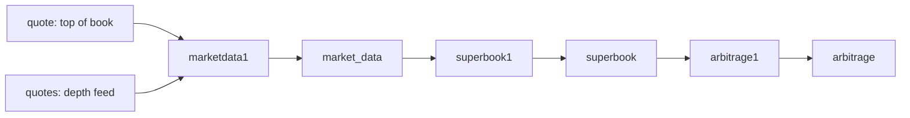

# Direct FX superbook and arbitrage

The superbook combines **directly quoted** liquidity for the same currency
pair across sources. It preserves source identity on every level so an
arbitrage row can name where to buy and where to sell.



The three services are registered in `uqf-stack` and publish ordinary
tickerplant tables, available in the RDB/HDB and the frontend table
catalog. Existing process ports are unchanged; the new offsets are 42, 43
and 44 from `KDBBASEPORT`, respectively. On an existing stack, restart
through `uqf-stack` to load the added table schemas as well as the
services.

They are **on demand**, not part of `uqf-stack start`:

```bash
uqf-stack start marketdata1 superbook1 arbitrage1
```

A q process on the community licence accepts sixteen concurrent inbound
connections, and every streaming job holds one to `stp1`. The default start
sits at thirteen with three held back, so this chain spends exactly the
spare slots - which is what they are for, and why nothing else should be
started alongside it without stopping something first. See
[the stack architecture](../integrations/torq/README.md#what-starts-with-the-stack-and-why-not-all-of-it).

Being a closed chain is what makes that safe. `market_data` is read only by
`superbook1`, `superbook` only by `arbitrage1`, and `arbitrage` by nothing,
so the three start and stop together and no default-start job notices
either way. Their own inputs, `quote` and `quotes`, are published by
`fxfeed1` and `quotesfeed1`, which do run by default.

## Source contract

`market_data` carries one **complete snapshot** per `(sym, source)`:

| Column | Meaning |
|---|---|
| `time` | Tickerplant receipt time of this normalized row |
| `sym` | Canonical BASEQUOTE pair, for example `EURUSD` |
| `source` | Independent liquidity source, stable across reconnects |
| `source_time` | Original quote timestamp in UTC |
| `bid_prices`, `ask_prices` | Direct prices in quote currency per base unit |
| `bid_sizes`, `ask_sizes` | Available **base-currency** quantities aligned with prices |

`quote.src` becomes `source`; scalar prices and sizes become one-level
vectors. The existing single-publisher `quotes` demo feed is mapped to
`UQFDEPTH`. These two feeds have no exchange event timestamp, so the
adapter preserves their original plant receipt time as `source_time`.
Non-FX symbols on the shared `quote` table are filtered out.

A new feed can publish this canonical shape, or add a source mapping to
`src/etl/streaming/market_data.q` using the existing `.qnorm` framework.
Use the same source identifier for duplicate transports of the same
liquidity. Do not interleave another producer into the source-less `quotes`
table. Incremental feeds must reconstruct a full source snapshot first.
Use the exchange event time when the feed supplies one.

Pairs must already use the same orientation, product and settlement date.
`USDEUR` and `EURUSD` remain different books. This version does not invert
pairs or construct synthetic crosses. The supplied producers generate
demo prices; their opportunities are synthetic until real feeds are wired.
`mkt_orderbook` is not an input because it has no sizes from which to
compute executable quantity.

## Aggregation and expiry

`superbook1` retains the latest snapshot per pair and source. A newer row
replaces both old ladders, including a side that is now empty. Older rows
are ignored; equal timestamps use arrival order. Future timestamps are
ignored, and retained source timestamps prevent delayed data from
resurrecting withdrawn liquidity.

Only positive, finite prices with positive, finite sizes are included.
Malformed vectors, missing source identity and null source timestamps are
rejected before updating state. Bids sort descending and asks ascending.
The corresponding `*_sizes`, `*_sources` and `*_times` vectors follow the
same permutation. Equal prices remain separate levels with their source
identity intact.

The default maximum age is five seconds, inclusive at the boundary,
controlled by `.qsub.superbook.max_age`. The process recomputes on updates
and every 500ms. Known pairs whose sources all expire produce an empty
superbook snapshot. Each output has an `as_of` calculation timestamp; the
plant stamps its own `time` independently.

## Reading opportunities

`arbitrage1` selects the largest positive `bid - ask` across **different**
sources. It reports `buy_source`, `sell_source`, `ask`, `bid`, and:

- `size`: the smaller base quantity at the selected two levels;
- `gross_edge`: bid minus ask, in quote currency per base unit;
- `gross_profit`: size times gross edge, in quote currency.

For a 1.101 bid for 100 EUR at LP_A and a 1.100 ask for 60 EUR at LP_B,
the row buys at LP_B, sells at LP_A, has size 60 EUR and gross profit
0.06 USD. This is the widest quoted edge, not a multi-level sweep or
maximum-total-profit calculation. Fees, credit eligibility and order
execution are outside this detector.

`arbitrage` is an append-only **status history**. A recovered spread,
withdrawal or expiry publishes `active=0b` with null prices and quantities.
Read the latest row per pair **before** filtering active rows, otherwise a
historical opportunity would stay visible after it cleared:

```q
latest:select by sym from arbitrage;
select from latest where active
```

The calculation includes all changes in an incoming batch; intermediate
states inside the same batch are not emitted. State is process-local and
rebuilds from incoming snapshots after a restart. A source that has not
sent a snapshot to this process is absent from its superbook.
