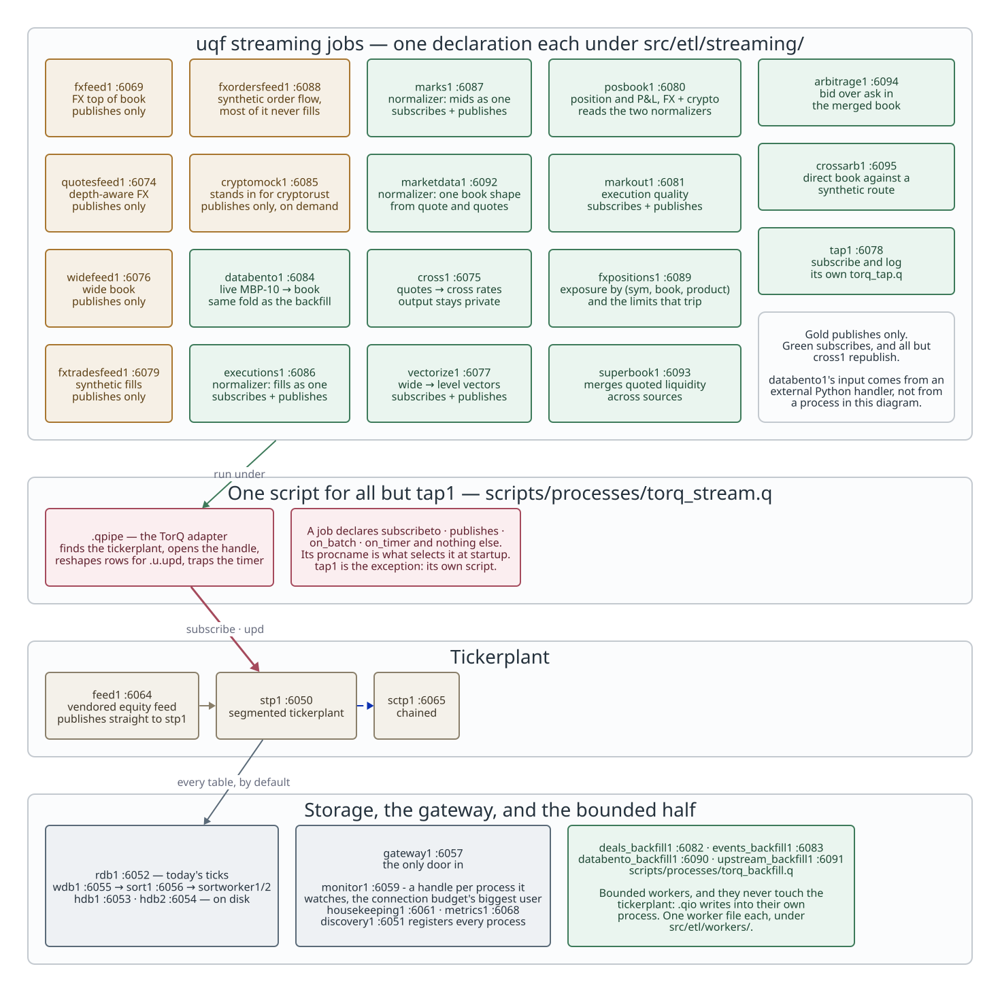
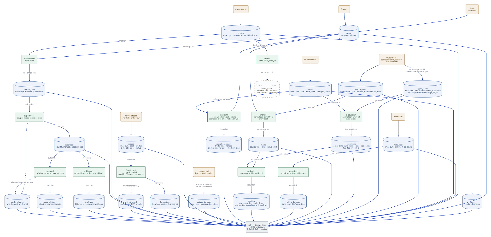
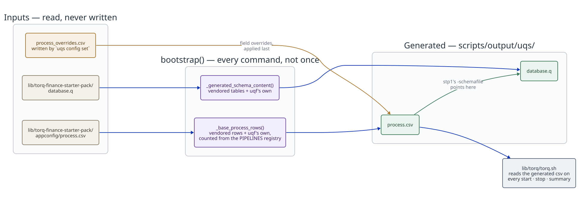

# uqf stack architecture

Diagrams for the running state of the uqf stack (see
[docs/guides/uqf-stack.md](../../guides/uqf-stack.md) for how to actually
start/stop/query it). Reflects what `uqf-stack list processes` shows today:
the vendored 23-process stack plus uqf's own additions (`fxfeed1`, `quotesfeed1`,
`widefeed1`, `cross1`, `vectorize1`, `tap1`, `fxtradesfeed1`, `posbook1`,
`markout1`, `databento1`, `cryptomock1`, `executions1`, `marks1`,
`fxordersfeed1`, `fxpositions1`, `marketdata1`, `superbook1`,
`arbitrage1`, `crossarb1`), and four bounded backfill processes (`deals_backfill1`,
`events_backfill1`, `databento_backfill1`, `upstream_backfill1`).
Declared is not the same as running here - see
[what starts with the stack](#what-starts-with-the-stack-and-why-not-all-of-it).

Direct FX arbitrage flows through `marketdata1` (`quote` and `quotes` into
`market_data`), `superbook1` (fresh source books merged into `superbook`), and
`arbitrage1` (gross cross-source price opportunities into `arbitrage`). The
three are on demand rather than part of `uqf-stack start` - see the
connection budget below. See
[the superbook guide](../../guides/superbook.md) for source identity, expiry
and the query for currently active opportunities.

`crossarb1` reads the same `superbook` and asks the other arbitrage
question: not "are two sources crossed on one pair" but "is the direct
market out of line with a route through other pairs" - EURJPY against
EURUSD x USDJPY, into `cross_arbitrage`. It is a second CONSUMER of that
chain rather than a fifth link in it, so it can run with or without
`arbitrage1`. See [the cross-arbitrage guide](../../guides/cross-arbitrage.md).

Each backfill process now NAMES the `.qbw` worker it runs. One script
serves all four and `UQF_BACKFILL_WORKER` picks which at runtime, so until
that field existed nothing statically joined a process to its worker — and
two workers (`databento_book_backfill`, `upstream_trades_backfill`) sat
fully declared with no process able to start them. `verify_pipeline_edges`
now refuses a worker with no process, a process with no worker, and a
process naming a worker that does not exist.

**The backfills are on the topology diagram but have no edge to the
tickerplant, and that is the point.** They were left off entirely at first,
on the reasoning that a backfill neither publishes to the tickerplant nor
subscribes — it reads an external source and writes its target table
directly — so drawing one would put an edge where there is none. True, but
their absence read as an omission rather than as a fact: a reader counting
processes found eleven in `uqf-stack list processes` and nine in the
picture. They now sit in their own band, with no edge and with the reason
written on the box.

They are declared processes so that **starting one wires it to discovery**:
TorQ registers a declared process at startup, so a running backfill is visible
in `.servers.SERVERS` and can be found by proctype `backfill`. Before that they
were spawned ad hoc and were invisible to the fleet. `startwithall=0` on both —
a backfill is a bounded job triggered with a window range (ETL-15 gives that
trigger to Airflow), not part of the stack `uqf-stack start` brings up.

For the authoritative per-process table - ports, scripts, the table each
owns, and its subscribe/publish edges - see
[processes.md](processes.md), which is **generated** from the pipeline
registry rather than written by hand. The diagrams below are
authored, because choosing what to show is a judgement; their process
*names* are checked against the registry by
`test_generated_docs.test_the_prose_architecture_doc_is_consistent_with_the_registry`,
which is how `tap1`'s absence from this paragraph was found.

## Process topology

Who connects to whom over IPC. Solid arrows are `.u.upd` publishes or
`.sub.subscribe` subscriptions (real data flow); dashed arrows are
discovery/registration only.

<!-- Source: docs/diagrams/stack-topology.d2. Rendered by
     scripts/generate/render_diagrams.py, which CI runs with --check.
     Do not edit the .svg. -->



Two different connection patterns coexist, deliberately - **and since #204
no job performs either one itself**. A streaming job declares `subscribes`
and `publishes`; `.qpipe` opens whichever handle that implies, and
`scripts/processes/torq_stream.q` wires the job's `publish` to it. The
patterns are still worth knowing, because they are why some processes need
a credential and some do not:

- **Publish only** (`fxfeed1`/`quotesfeed1`/`widefeed1`/`fxtradesfeed1`,
  and the vendored `feed1`) needs no credential: `.qpipe.feed_handle`
  finds the tickerplant with
  `.servers.gethandlebytype[\`segmentedtickerplant;\`any]` and that is a
  self-managed handle, no `.servers.startup[]`.
- **Subscribing** (`cross1`/`vectorize1`/`posbook1`/`markout1`) needs a
  real `.servers`-managed, access-listed handle -
  `.qpipe.subscribe_etl` runs `.servers.startup[]` against
  `accesslist.txt`. They borrow the already-credentialed `metrics`
  proctype rather than adding a password file to the vendored tree (see
  `stack/procs.py`'s `add_extra_process` comments).

A job that both subscribes and republishes - `vectorize1`, `posbook1`,
`markout1` - needs both, and gets both from the same runner. That used to
be something each script arranged for itself, which is what made the eight
of them near-copies.

`databento1` is the newest subscriber and the only one whose input comes
from outside q entirely: an external Python handler
(`external/databento_feed.py`) holds a live Databento subscription and publishes
raw MBP-10 onto `databento_mbp10`, and `databento1` folds it into
`databento_book` with the same `.qxf` transform the ODBC backfill applies.
The handler is not a process here, for the reason cryptorust is not: a q
process cannot hold that subscription, so it is started by `uqf-stack
databento start` rather than by `torq.sh`.

The crypto half of the stack has the same shape, with one difference in who
publishes the raw rows. `crypto_book` and `crypto_trades` are declared for
cryptorust's two kdb recorders, which are Rust binaries connected to live
venues. `cryptomock1` stands in for both when cryptorust is not running: it
walks a simulated market per (venue, sym), publishes the ladder onto
`crypto_book`, and fills the maker's own touch using cryptorust's fill
model, publishing each fill onto `crypto_trades` in the recorder's exact wire
shape. It is `startwithall:0` and started **instead of** cryptorust's
recorders, never beside them - two publishers onto one table would
interleave invented rows with real ones. Neither it nor anything downstream
reads `crypto_sim_fills`; those are the paper strategy's own fills and are
not a position.

`executions1` and `marks1` are **normalizers** - a job kind of their own
(`.qnorm`, `src/etl/core/normalizer.q`). A normalizer subscribes to several
tables that carry the same fact in different shapes and publishes one
canonical table, with one declared `.qxf` transform per source; `define`
refuses a mapping whose output drifts from the canonical schema. `executions1`
maps `trades` and `crypto_trades` onto `executions`; `marks1` maps `quote`
and `crypto_book` onto `marks`. `posbook1` reads those two and nothing else,
so one position book carries FX and crypto from one subscription each, and a
new market is a mapping in a normalizer rather than a branch in the
position job. (Note `executions`, not `fills`: `fills` is a q builtin, and a
table by that name would shadow the verb in every process holding it.)

`fxordersfeed1` and `fxpositions1` are the FX positions service: synthetic
order flow in, net exposure by (sym, book, product) out, with limit breaches
throttled so a standing breach does not republish every tick. They are worth
a note because they are the one pair that runs **two** ways. `torq_stream.q`
starts them here like any other streaming job; `run_stream.q` starts the same
two job files on stock kdb+ against `.qtick`, with `lib/torq` never loaded.
That is the publish seam working as intended - a job is TorQ-free code and
the runner decides the transport - and being runnable without TorQ was never
a reason not to be startable with it.

`tap1` is the one process still running its own script
(`scripts/processes/torq_tap.q`): it chooses its tables at runtime rather
than declaring them, which is exactly what a `.qstream` declaration cannot
express.

### What starts with the stack, and why not all of it

`uqf-stack start` does not start every process it knows about, and that is
deliberate. A q process running on the community licence in `~/.kx/kc.lic`
accepts **sixteen** concurrent inbound connections and resets the
seventeenth. Every streaming job is its own process holding one handle to
`stp1`, so the plant is the scarce resource in this topology, and the
sixteen slots are spent before the process list runs out.

The failure is silent, which is the part worth knowing. `stp1` does not log
the refusal, the shut-out process retries forever inside `torq_stream.q`'s
initialisation, and because `uqf-stack summary` is a PID check it reports
that process as `up`. Nothing anywhere says the stack is short. What you get
instead is a topology decided by start order - whichever sixteen processes
won the race that boot - which changes every time. It was found the hard way
when `fxpositions1` and `executions1` came up "up" and never subscribed to
anything (#285).

So the budget is declared rather than discovered. `LICENCE_CONNECTION_LIMIT`
and `INBOUND_RESERVE` in `model/pipeline_edges.py` hold the cap and the
slots kept back for ad-hoc handles (`uqf-stack query`, `uqf-stack schema`,
the frontend's health view each take one while they run), and
`verify_pipeline_edges` counts the `startwithall=1` plant clients against
them. Adding a process that would push the default start over the cap now
fails in CI, naming every client, rather than quietly costing someone else
their slot.

Declaring a job and running it are separate decisions. These stay declared,
keep their schema row and their place in the DAG, and are one command away:

| process | why it is not in the default start |
|---|---|
| `cross1` | a leaf: it subscribes to `quotes` and publishes no table, so nothing stalls while it is stopped |
| `widefeed1`, `vectorize1` | a closed pair - the only producer of `wide_book` and its only consumer - so they start and stop together |
| `databento1` | subscribes to `databento_mbp10`, which only the external feed handler and `databento_backfill1` publish, so on a default start it consumes nothing |
| `feed1` | the starter pack's random demo feed; `fxfeed1` already publishes `quote` from the FX curve, and running both interleaved two producers into one table |
| `marketdata1`, `superbook1`, `arbitrage1` | the direct-arbitrage chain: `market_data` is read only by `superbook1`, `superbook` only by `arbitrage1` and `crossarb1`, and their outputs by nothing, so the chain moves together |
| `crossarb1` | the synthetic-versus-direct detector, a second consumer of that chain - and the fourth connection against three spare, so it needs something stopped first |
| `cryptomock1`, `tap1`, the four backfills | on-demand for their own reasons - see the notes in `processes.md` |

```bash
uqf-stack start widefeed1 vectorize1                 # the vectorize branch
uqf-stack start cross1                               # quotesfeed1 already runs
uqf-stack start marketdata1 superbook1 arbitrage1    # direct FX arbitrage
uqf-stack start marketdata1 superbook1 crossarb1     # cross-currency instead
```

The last two lines are alternatives, not a sequence: `arbitrage1` and
`crossarb1` both read `superbook` and answer different questions, and
running the chain plus BOTH is four plant connections against three spare.

Each of those has its upstream producer either in the default set or shed
alongside it, so starting one is enough - that property is held by a test,
not by habit. Starting several at once eats into the reserve; if you need
the whole graph up at the same time, stop something first or raise the
budget against a licence that allows it.

## Data pipeline: table by table

What each process actually reads and writes, and where the two uqf ETL
processes diverge - one publishes its output back onto the tickerplant
(a real, persisted table), the other keeps it private to the process.

<!-- Source: docs/diagrams/stack-dataflow.d2. -->



`posbook1` and `markout1` are the two processes in this stack that run
uqf's actual eFX business logic (position/PnL and execution quality, not
just market-data reshaping) against live data. `posbook1`'s
`.qsub.posbook.book` (a private, in-process `.qpos`-shaped keyed table, same
"wrap a pure function with local mutable state" pattern `cross1`'s
`.qsub.cross.quotes` mirror uses) accumulates fills via `.qpos.apply_fill`,
marked to a live mid tracked off its own `quote` subscription; `position`
is a snapshot republished per fill. `markout1` can't score a fill the
instant it arrives - `.qexec.markout_at_horizons` needs a reference quote
at trade_time+horizon, which by definition hasn't happened yet - so it
buffers trades/quotes in `.qsub.markout.pending`/`.qsub.markout.quote_hist`
and scores+drains them on a 1s repeating timer once each trade is old
enough that its furthest horizon's quote should already exist. Unlike
`cross_quotes`, both `position` and `execution_quality` are real,
persisted tables (round-trip through `rdb1`/`wdb1`/`hdb`, same as
`mkt_orderbook`), since this history is worth keeping.

`cross_quotes` is drawn dashed because it never becomes a real database
table - it's `.qsub.cross.crosses`, a plain in-memory table inside
`cross1`'s own process, queryable only by connecting to `cross1` directly
(`uqf-stack query "select from cross_quotes" --port 6075`). `mkt_orderbook`
is a full round trip instead: `vectorize1` folds `wide_book` and republishes
onto `stp1`, so it flows through `rdb1`/`wdb1`/`hdb` exactly like any
vendored table and survives past `vectorize1` restarting.

### A published table is a defined table

`.u.upd` onto a table the tickerplant does not define discards the rows and
says nothing - no throw at the publisher, no line in the plant's log, no row
downstream. It is the quietest failure in the stack, and it is not
theoretical: `fxpositions1` published a correct sixteen-row book every five
seconds onto `fx_position` and `fx_limit_breach` for as long as it had been
running, and neither table existed (#287). Both had been defined in
`scripts/processes/uqf_stack_tables.q` the whole time - the registry simply
never asked for them, because `database.q` was generated from each
pipeline's `schema` field and `fxpositions1` publishes two tables and owns
neither.

The rule now holds from both ends:

- **At declaration.** `database.q` is generated from what each pipeline
  says it *publishes*, so a table a pipeline sends rows to is a table `stp1`
  is told about, and there is no second field to forget.
  `plant_schema.undefined_published_tables` reports any that slip through,
  and the Python suite fails on a non-empty answer.
- **At startup.** `.qpipe.assert_publishable` asks the plant for `tables[]`
  before wiring a job's publish seam, and refuses to start when a declared
  table is absent - naming every missing one, so a single restart fixes
  them all.

Adding a table is therefore two edits and no third: define it in
`uqf_stack_tables.q`, and name it in the publishing pipeline's `publishes`.

## Config generation

Every process/table addition here (`fxfeed1` through `vectorize1`, and
anything the `new-process` wizard adds) follows the same rule: read the
vendored file fresh, generate an extended copy, point the real process at
the copy - the vendored `lib/torq-finance-starter-pack/appconfig/process.csv`
and `database.q` are never written to.

<!-- Source: docs/diagrams/config-generation.d2. -->



`bootstrap()` (`python/uqf_stack/src/uqf_stack/stack/runtime.py`)
regenerates both files on every command - `start`, `stop`, `summary`,
everything - so nothing here is a one-time setup step; the generated
files are always a fresh function of the vendored tree plus whatever's
in the three small, git-tracked extension files.
