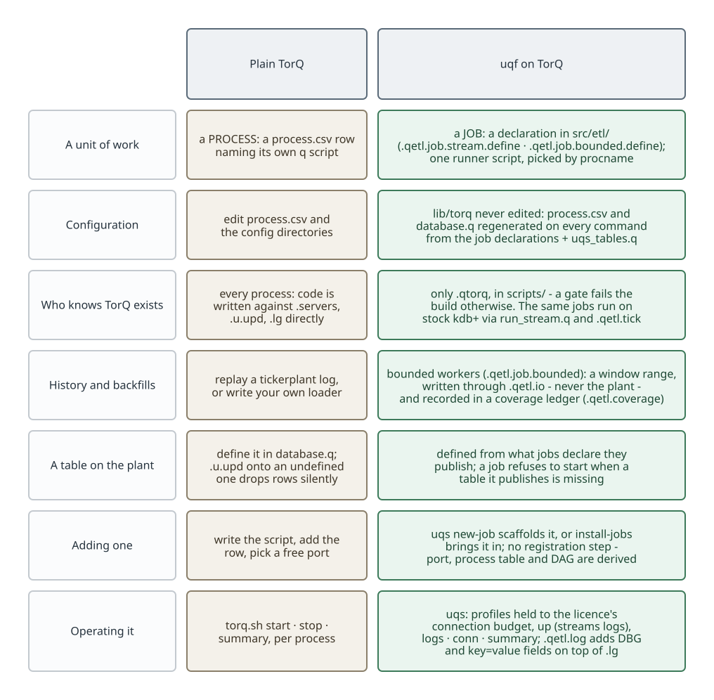
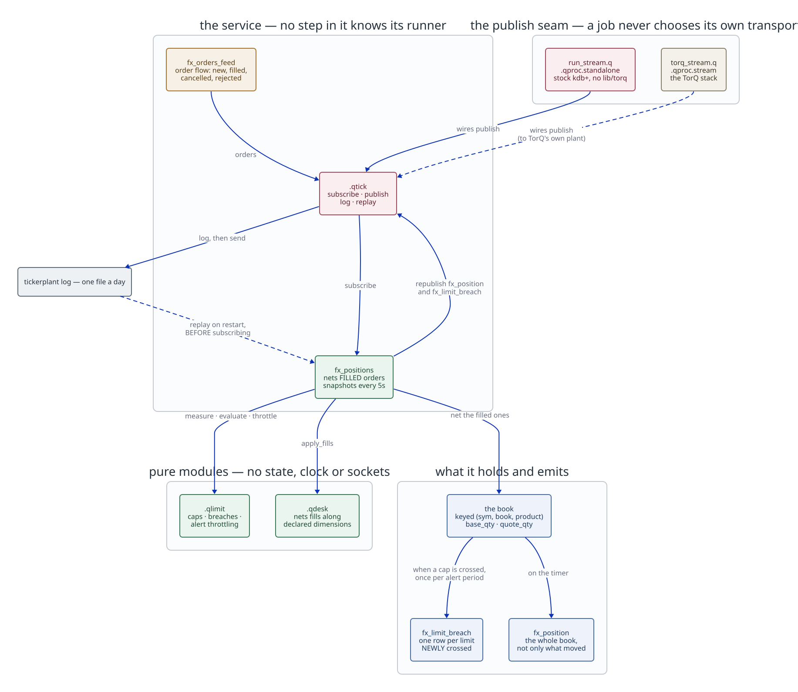
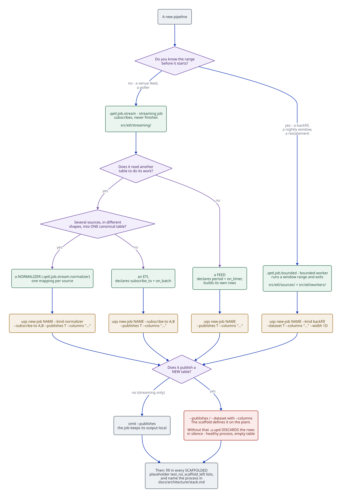
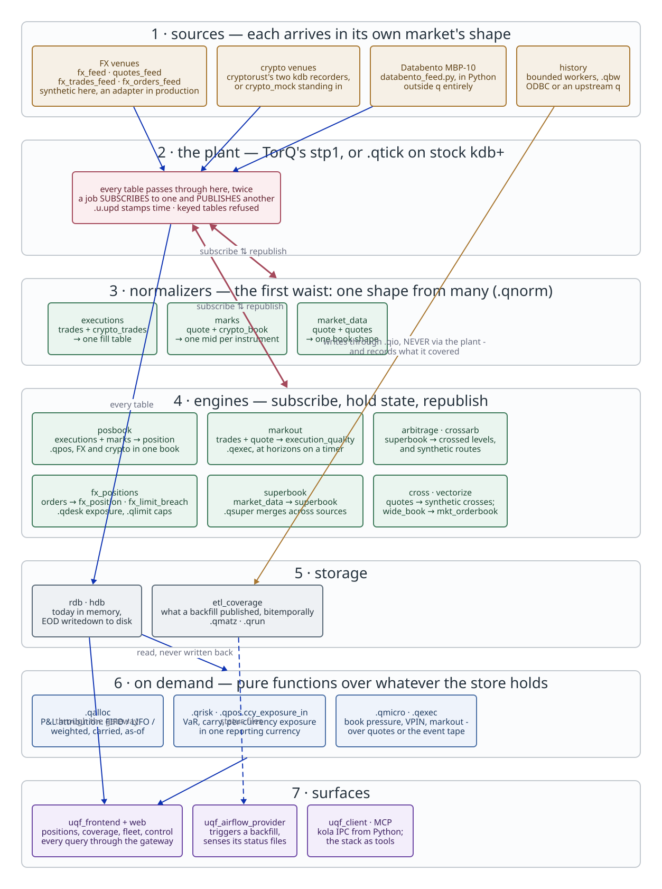

## TorQ stays. What changes is around it. {.smaller}

::: {.columns}
::::: {.column width="55%"}
{height="740"}
:::::
::::: {.column width="45%"}
- stp1, the RDB, WDB and HDB, discovery and the gateway are **TorQ's,
  unmodified**.
- `lib/torq` and the starter pack are vendored and **never edited**.
- uqf changes three things:
  - what you write: a **job declaration**, not a process;
  - who knows TorQ exists: **one namespace**, `.qpipe`;
  - how you run it: **`uqs`**, in place of editing process.csv and calling
    torq.sh.
:::::
:::

## The whole system {.smaller}

{.r-stretch}

Declarations in `src/etl/` → framework in `src/etl/core/` → **one TorQ adapter**
in `scripts/` → the running stack. No q file under `src/` knows TorQ exists;
`check_etl_layering` fails the build otherwise.

## One runner script, many jobs {.smaller}

::: {.columns}
::::: {.column width="58%"}
{height="740"}
:::::
::::: {.column width="42%"}
**Plain TorQ.** Each process names its own q script in process.csv.

**uqf.** Every streaming job runs the same `scripts/processes/torq_stream.q`. It
picks its declaration by procname and wires:

- subscriptions (`.qpipe.subscribe_etl`)
- the publish seam (`.qpipe.publish`)
- timers and log levels

It refuses to start when a table it publishes isn't defined on the plant, rather
than dropping the rows silently.
:::::
:::

## The same job, with or without TorQ {.smaller}

::: {.columns}
::::: {.column width="60%"}
{height="740"}
:::::
::::: {.column width="40%"}
A job calls a **publish seam**. It never calls `.u.upd`.

- on TorQ, `torq_stream.q` wires the seam to the tickerplant;
- on stock kdb+, `run_stream.q` wires it to `.qtick`;
- in a test, a recorder takes its place.

So the business logic can be tested without starting a stack.
:::::
:::

## Configuration is generated, never hand-edited {.smaller}

{.r-stretch}

**Plain TorQ:** edit process.csv and database.q, and pick free ports. **uqf:**
both files are regenerated on every `uqs` command from the job declarations,
`uqs_tables.q` and `uqs config-set` overrides. There is no registration step:
ports, rows and the job DAG are all derived.

## Streaming or bounded: two kinds of job {.smaller}

::: {.columns}
::::: {.column width="45%"}
{height="740"}
:::::
::::: {.column width="55%"}
**Streaming** (`.qstream.define`) runs on the plant: it subscribes, computes and
publishes.

**Bounded** (`.qbw.define`) takes a window range, e.g. a backfill or a day's
reload. It writes through `.qio`, **never the plant**, and records each window
in a coverage ledger (`.qmatz`, `.qrun`). So it can resume and fill gaps.

**Plain TorQ** has no bounded job. It replays the tickerplant log, or you write
your own loader.

**Normalizers** (`.qnorm`) map one vendor's schema onto the house tables.
:::::
:::

## A chain is just ordinary tables {.smaller}

{.r-stretch}

Each stage is a separate job that subscribes to the table before it and
publishes the next. No stage calls another, so any link can be restarted,
replaced or queried on its own.

## Composed into a desk

{.r-stretch}

## Adding a job: scaffold, don't register {.smaller}

{.r-stretch}

`uqs new-job <name> [--kind streaming|normalizer|backfill]` writes the job, its
table and a test that fails until you fill it in. A streaming job that
subscribes to nothing is a feed. `uqs install-jobs` brings in jobs kept outside
the tree. The next `uqs` command picks up either.

## Operating it: `uqs` in place of `torq.sh` {.smaller}

  |             | Plain TorQ                           | uqf                                                                                                                                          |
  | ---         | ---                                  | ---                                                                                                                                          |
  | start       | `torq.sh start <proc>` / `start all` | `uqs start --profile fx,arbitrage`: named sets of processes                                                                                  |
  | connections | found out at runtime                 | every profile is checked against the licence's budget (16 − 2 = 14 on the community licence; set `UQS_LICENCE_CONNECTIONS` for a larger one) |
  | watch       | tail the log files                   | `uqs up`: starts the processes and streams every log to the console; Ctrl-C stops them                                                       |
  | inspect     | `torq.sh summary`                    | `uqs summary` · `logs` · `conn`                                                                                                              |
  | config      | edit the csv                         | `uqs config-set <proc> <key> <value>`, persisted and regenerated                                                                             |
  | logging     | `.lg`: ERROR / ERR / WARN / INF      | `.qlog` on top of it: adds DBG, and key=value fields                                                                                         |

  : {tbl-colwidths="[12,33,55]"}

## Where to go next

- [`docs/README.md`](../README.md): the documentation map
- [`docs/guides/uqs.md`](../guides/uqs.md): running the stack
- [`docs/guides/new-pipeline.md`](../guides/new-pipeline.md): adding a pipeline,
  end to end
- [`docs/architecture/stack.md`](../architecture/stack.md): the running stack,
  table by table
- [`docs/architecture/pipeline-philosophy.md`](../architecture/pipeline-philosophy.md):
  why `src/etl/` is shaped this way
