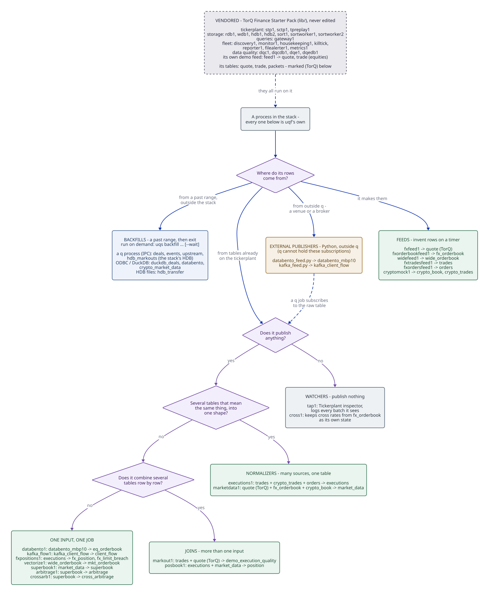

# Services - Showcase

Everything the uqf stack runs, one short card per process: what it does, what
goes in and what comes out, and how to see it. The groups follow the data, from
where rows are made to what is computed from them. A card with **Details** links
to a full page on how it is built and why.

The fastest way to see a group running is its start profile:
`uqs up --profile fx` starts what the FX chain needs and streams its logs. The
whole stack is `uqs start`. Starting and stopping, config and logs are covered
in [running the uqf stack](../guides/uqs.md). Ports, subscriptions and the full
table list are in the generated [process table](../reference/processes.md).

The tree sorts every process by where its rows come from, then by what it does
with the tables it reads. Databento and Kafka are worth a second look: the
publisher is a Python handler outside q, because a q process can't hold either
subscription, and `databento1` and `kafka_flow1` are ordinary subscribers to the
raw table it publishes.

The dashed box on top is what's **vendored**: the TorQ Finance Starter Pack
under `lib/`, which is never edited - the tickerplant, storage, gateway and
fleet processes everything here runs on, and its own tables. Every process in
the tree is uqf's own; a vendored table it reads or writes is marked **(TorQ)**.

## Feeds

These invent or replay data, so the rest of the stack has something to work on.

**`fxfeed1` · synthetic FX quotes** --- top-of-book quotes for EURUSD, GBPUSD,
USDJPY and AUDUSD: a small random walk around a fixed spot, one pip wide.
Publishes `quote`. [Details](synthetic-feeds.md)

**`fxorderbookfeed1` · synthetic FX books** --- depth-aware FX quotes, three
levels a side. Publishes `fx_orderbook`, which the depth tools and the cross
calculator read. [Details](synthetic-feeds.md)

**`fxtradesfeed1` · synthetic FX fills** --- client trades against the invented
market, the fills markouts and positions are computed from. Publishes `trades`.

**`fxordersfeed1` · synthetic order flow** --- orders, most of which never
become a fill: the input to position limits. Publishes `orders`.
[Details](fx-positions.md)

**`widefeed1` · a wide order book** --- a book with one column per level
(`bid_px_00`, `bid_px_01` and so on), the shape a vendor CSV usually has.
Publishes `wide_orderbook`, and runs as a pair with `vectorize1`. Profile
`depth`.

**`cryptomock1` · crypto books and fills** --- a stand-in for cryptorust's two
kdb recorders, for when they aren't running. Publishes `crypto_book` and
`crypto_trades`. Profile `crypto`, run *instead of* the real recorders, never
alongside them. [Details](crypto-recorder.md)

## External sources

Each of these needs a feed handler outside q, because a q process can't hold the
subscription itself.

**`databento1` · live Databento depth** --- Databento's MBP-10 updates,
published by `external/databento_feed.py`, folded into the stack's book shape.
Reads `databento_mbp10`, publishes `eq_orderbook`. [Details](databento.md)

**`kafka_flow1` · client flow from Kafka** --- client FX trades consumed off a
Kafka topic by `external/kafka_feed.py`, deduplicated on the record's
(partition; offset) so a redelivery is never counted twice. Reads
`kafka_client_flow`, publishes `client_flow`. [Details](kafka.md)

## Normalisers

Several sources say the same thing in different shapes. A normaliser folds them
into one table, so whatever reads it handles one market and one shape.

**`executions1` · every fill as one table** --- FX `trades` and `crypto_trades`
become `executions`.

**`marketdata1` · every venue's book** --- FX `quote` and `fx_orderbook`, and
`crypto_book`, as `market_data`, each row keeping its source and the source's
own time. `posbook1` values positions from it, and it heads the arbitrage chain,
which takes the FX books only. Profile `fx`. [Details](superbook.md)

## Analytics

**`posbook1` · positions and P&L** --- a running position per instrument from
`executions`, valued from `market_data`: an FX position at its pair's last
level-0 mid, a crypto position at the best mid across venues no more than five
seconds old, the same reference `crypto_markout1` scores against. One book
carries FX and crypto, because it reads the normalisers rather than each market.
Publishes `position`. Profile `fx`.

**`demo_markout1` · execution quality** --- each fill against the mid one and
ten seconds later: did the price move for or against the trade? Reads `trades`
and `quote`, publishes `demo_execution_quality`. Profile `fx`.
[Details](markouts.md)

**`fxpositions1` · exposure and limits** --- net exposure by symbol, book and
product from `executions`, the fills `posbook1` nets too, with a breach row
whenever a limit is crossed. Publishes `fx_position` and `fx_limit_breach`.
Profile `fx`. [Details](fx-positions.md)

**`superbook1` · one book from every source** --- the latest book from each
source merged per pair, with stale liquidity expired on a timer. Publishes
`superbook`. Profile `arbitrage`. [Details](superbook.md)

**`arbitrage1` · crossed prices across sources** --- where one source's bid is
above another's ask on the same pair. Publishes `arbitrage`. Profile
`arbitrage`. [Details](superbook.md)

**`crossarb1` · crossed prices through other pairs** --- the direct book against
a synthetic route, for example EURJPY against EURUSD × USDJPY. Publishes
`cross_arbitrage`. Profile `arbitrage`. [Details](cross-arbitrage.md)

**`vectorize1` · wide book to vector columns** --- `wide_orderbook`'s per-level
columns folded into one vector per side, the shape the pricing functions take.
Publishes `mkt_orderbook`. Profile `depth`.

**`cross1` · synthetic crosses** --- cross rates derived from `fx_orderbook`,
kept as the process's own state and published nowhere. A leaf you can stop
without anything downstream noticing. Profile `depth`.

**`alert_sink1` · limit breaches to a webhook** --- POSTs each `fx_limit_breach`
row as JSON to the URL in `UQF_SOURCE_CRED_ALERT_SINK`, throttled, retried three
times and then recorded in `dead`. At least once, in memory. Refuses to run with
no URL. On demand, no profile. See
[pipeline-declarations](../reference/pipeline-declarations.md#sinks-----alert_sink).

**`last_value1` · the current price of every sym** --- the newest level-0 bid,
ask and mid per sym from `market_data`, FX and crypto, as a published table. An
older book never overwrites a newer one. Read the last row per sym for the one
shared answer: `select by sym from last_value`, from the RDB or through the
gateway. Publishes `last_value`. Profile `fx`; not in `uqs start`.

## Backfills

A backfill takes a date range, fills it, records which windows are covered, and
exits. Run one with `uqs backfill <worker> --from … --to … [--wait]`; running it
again skips everything already covered. None starts with the stack.

**`deals_backfill1` · demo deals** --- FX deals from a q source, the reference
example of a bounded worker.

**`events_backfill1` · an event tape** --- events from a q source, into
`event_tape`.

**`upstream_backfill1` · another q process** --- trades read from an upstream q
process over IPC.

**`duckdb_deals_backfill1` · deals from DuckDB** --- mock FX deals copied out of
a DuckDB file over ODBC, a day at a time.

**`databento_backfill1` · Databento history** --- past MBP-10 depth over ODBC,
folded with the same transform `databento1` applies live.

**`crypto_market_data_backfill1` · recorded crypto** --- cryptorust's recorded
crypto books and trades replayed from DuckDB, an hour at a time.
[Details](crypto-recorder.md)

**`hdb_demo_markouts_backfill1` · markouts from history** --- the HDB's fills
marked out against its quotes, into `demo_execution_quality`. It refills what
`demo_markout1` missed while it was down; `uqs gaps markout` names those holes.
[Details](markouts.md)

**`hdb_transfer_backfill1` · one kdb+ database into another** --- trades read
from another HDB's files, with notional added, into `trades_copy`. The worked
example: `q scripts/examples/hdb_transfer_example.q` runs it end to end.
[Details](../scaffolding/hdb-transfer.md)

## Diagnostics

**Tickerplant inspector · `tap1`** --- point it at any table and it prints what
arrives. The first thing to start when a table stays empty and you don't know
whether rows are arriving. Started on demand. [Details](tap.md)
