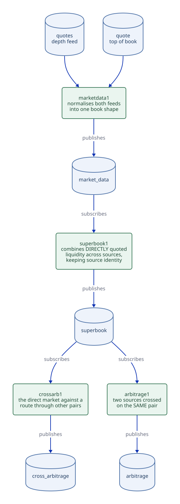

# Cross-currency arbitrage

`crossarb1` asks a different question from `arbitrage1`, which is why it is a
different process.

  | process      | question                                                                              |
  | ---          | ---                                                                                   |
  | `arbitrage1` | are two **sources** crossed on the **same** pair?                                     |
  | `crossarb1`  | is the **direct** market for a pair out of line with a **route through other pairs**? |

Is EURJPY trading away from EURUSD × USDJPY, and by how much, at a size you
could actually work?

<!-- Source: docs/diagrams/superbook-chain.d2, the same diagram the superbook
     guide embeds. The fan-out from `superbook` is the part this guide is
     about, and a second diagram of it would be a second thing to keep in
     step. Rendered by scripts/generate/render_diagrams.py (CI --check). -->



Look at the fan-out from `superbook`: both jobs read it, so `crossarb1` is a
second **consumer** of the `marketdata1` chain rather than a fifth link in it.
Neither needs the other, and stopping one leaves the other running.

## Algorithm

The arithmetic is not written in this job. `src/pricing/forwards.q` already
walks depth across an arbitrary chain of legs, converting the notional hop by
hop, and marks a shortfall when a middle leg cannot carry it. What is left is
one idea:

> the shortest path **excluding the direct leg** is the synthetic route

```q
q) .qfwd.ccy_shortest_path[`EURUSD`GBPUSD`USDJPY`AUDUSD`EURJPY except `EURJPY;`EUR;`JPY]
`EURUSD`USDJPY
```

With the route in hand, price both sides of it at the notional and compare
against the direct book:

- synthetic **bid** above the direct **ask** → buy the pair, sell the route
  (`direction` = `` `buy_direct ``)
- direct **bid** above the synthetic **ask** → the reverse
  (`` `buy_synthetic ``)

Worked through, with EURUSD 1.1000/1.1002 and USDJPY 150.00/150.02:

```
synthetic EURJPY bid = 1.1000 * 150.00 = 165.000000
synthetic EURJPY ask = 1.1002 * 150.02 = 165.052004
```

A direct EURJPY ask of 164.90 is 0.10 cheap: buy 1mm EUR directly at 164.90,
sell it through the route at 165.00, for 100,000 JPY of gross edge. That is the
first test in `tests/q/test_cross_arbitrage.q`, and every expected number in
that file is computed by hand on purpose --- see
[why](#why-hand-computed-test-numbers).

## Output

`cross_arbitrage` is an append-only **status history**, like `arbitrage`: an
opportunity that recovers, expires or is withdrawn publishes `active=0b`. Read
the latest row per pair **before** filtering on `active`, or a cleared
opportunity stays on screen:

```q
latest:select by sym from cross_arbitrage;
select from latest where active
```

  | column                             | meaning                                                                         |
  | ---                                | ---                                                                             |
  | `route`                            | the legs the synthetic price was built from, in traversal order                 |
  | `direct_price` / `synthetic_price` | the two sides being compared, at `size`                                         |
  | `gross_edge`                       | their difference, in the quote currency per base unit                           |
  | `gross_profit`                     | `size × gross_edge`                                                             |
  | `fully_filled`                     | whether the notional can be worked through **every** leg                        |
  | `skew`                             | how far apart the legs of the route were quoted                                 |
  | `as_of`                            | the **oldest** leg's timestamp — a synthetic price is as old as its stalest leg |

### Two columns to read first

**`fully_filled`.** A route is only as deep as its thinnest leg. If EURUSD can
fill 1mm EUR but USDJPY can only absorb 100k of the ~1.1mm USD that produces,
the edge is real at some smaller size and not at this one. It is reported with
`fully_filled=0b` rather than silently priced at a level nobody can trade --- an
unfillable "profit" is the main way a detector like this lies.

**`skew`.** A synthetic price multiplies legs quoted at different moments.
`superbook`'s own expiry does not prevent a two-second-old EURUSD being combined
with a fresh USDJPY, which manufactures an edge out of nothing but elapsed time.
Legs further apart than `.qsub.cross_arbitrage.max_skew` (2 seconds) are
published with `active=0b` and their `skew` filled in --- present so it can be
seen, rather than dropped.

## What it does not claim

Gross quoted edge only. No fees, no brokerage, no credit eligibility, no
settlement-date matching, no execution, and no attempt to size the trade beyond
the single configured notional (`.qsub.cross_arbitrage.notional`, 1mm). Nothing
here is a trading signal.

Routes are shortest-path only. A longer route that happened to price better is
not searched for, because enumerating every route is combinatorial in the number
of currencies and a detector that reports several invites reading the best one.

## Running it

On demand, like the rest of the chain, and as a set:

```bash
uqs start --profile arbitrage
```

which is `marketdata1`, `superbook1`, `arbitrage1` and this process. Naming
those four positionally on a running default start instead is four plant
connections more than it holds, and [the
budget](../architecture/stack.md#what-starts-and-why-not-all-of-it) has no room
for them --- the profile is checked against it before anything starts.
`crossarb1` also runs without `arbitrage1`: they answer different questions and
neither depends on the other.

## Why the triangle exists

The four original demo pairs are **all USD-legged**:

```
EURUSD  GBPUSD  USDJPY  AUDUSD
```

Every route between two non-USD currencies passes through USD exactly once and
never returns. There is no cycle, so there is no direct cross to compare a
synthetic against, and a detector built on that feed set would publish inactive
rows forever.

`EURJPY` was added to `.qsynth.pairs` to close the triangle, starting at
`1.0850 × 149.50`. Each pair then walks **independently**, so the three drift
apart and the synthetic and direct prices cross from time to time. That is what
gives the detector something to report --- and it is also why those reports are
an artefact of three unrelated random walks, not a market. On real feeds the
same code answers a real question; on this one it is a demonstration that the
pipeline works.

## Why hand-computed test numbers

A wrong inversion on one leg of a route does not throw. It produces a
plausible-looking edge that is not there.

A round-trip identity --- price it forwards, then backwards, check you get back
where you started --- passes with **both** legs wrong, so it proves nothing
about direction. The only check that catches an orientation bug is an
independently known price, which is why every expected value in
`tests/q/test_cross_arbitrage.q` is worked out by hand and written in the test
beside the assertion. One test exists purely for this: a direct book set exactly
equal to the synthetic must report **no** opportunity, because an inverted leg
would put the synthetic orders of magnitude away and report a vast edge instead.
