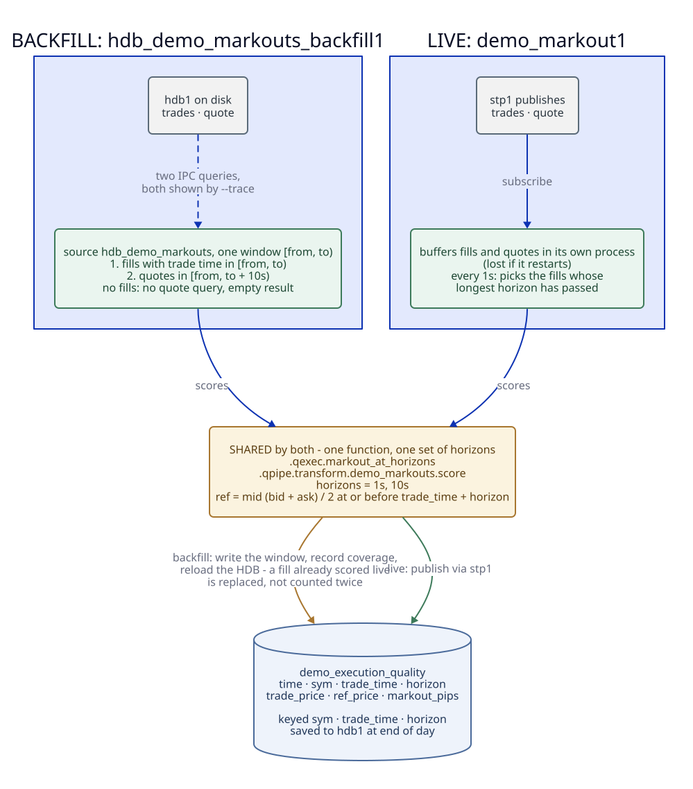

# Execution quality (markouts)

How good was each fill? A markout compares a fill's price with the market mid a
short time after it. If you bought and the mid then rose, the fill was good.

Two markout paths, for two kinds of fill:

- **Real crypto fills**: `crypto_markout1` scores cryptorust's real fills
  (`crypto_trades`) in basis points into `crypto_execution_quality`. See [Real
  fills](#real-fills-crypto_markout1) below.
- **The demo's FX fills**: two processes write `demo_execution_quality`, for the
  invented pairs the demo's own feeds publish onto `trades` and `quote`:
  - **`demo_markout1`**, live, scores fills as they stream past.
  - **`hdb_demo_markouts_backfill1`**, bounded, scores a window of fills already
    in the HDB: the ones `demo_markout1` never saw.



## What both compute

For each fill and each horizon (1s and 10s), the reference price is the mid,
`(bid + ask) / 2`, of the latest quote at or before `trade_time + horizon`. The
markout is `side × pip_factor × (ref_price − trade_price)`, in pips: positive
means the market moved in your favour after the fill.

Both jobs use the same function and the same horizons:
`.qexec.markout_at_horizons`, through `.qpipe.transform.demo_markouts.score`
(one function both jobs call), with `.qpipe.transform.demo_markouts.horizons`.
The backfill reads the horizons at run time, so changing them in
`demo_markout.q` changes both jobs, and a fill scored by both comes out
identical.

A fill with no quote after it keeps a row with a null `ref_price` and
`markout_pips`, rather than being dropped, so the gap shows.

## The table: `demo_execution_quality`

  | column         | meaning                                                        |
  | ---            | ---                                                            |
  | `time`         | `trade_time + horizon`, the instant the reference mid was read |
  | `sym`          | the pair                                                       |
  | `trade_time`   | when the fill happened                                         |
  | `horizon`      | 1s or 10s                                                      |
  | `trade_price`  | the fill price                                                 |
  | `ref_price`    | the mid at `trade_time + horizon`                              |
  | `markout_pips` | the markout, in pips                                           |

The backfill writes keyed on **`sym, trade_time, horizon`**. A fill that both
jobs scored, or a window the backfill writes twice (a second `--version`), is
replaced, not counted twice.

## `demo_markout1`, live

`demo_markout1` (`src/etl/streaming/demo_markout.q`) subscribes to `trades` and
`quote` on `stp1`. It can't score a fill the moment it arrives, because the
quote at `trade_time + 10s` doesn't exist yet. So it buffers fills and quotes,
and once a second it scores the fills whose longest horizon has passed. It
publishes the rows through `stp1`, and end of day saves them to the HDB.

The buffers live in its process. A fill it never saw, because it was down or
restarting, or because the fill predates it, is never scored by it.

## `hdb_demo_markouts_backfill1`, the backfill

A bounded job: give it a range, and it scores every fill in the HDB inside it.

```
export UQF_SOURCE_CRED_HDB_DEMO_MARKOUTS=localhost:<hdb1's port>   # 6053 at the default base port
uqs backfill hdb_demo_markouts_backfill --version v1 --from 2026-09-01 --to 2026-09-30
uqs logs hdb_demo_markouts_backfill1 -f
```

Without the variable it runs on its fixture, a small built-in data set. That is
what tests and `--mode plan`/`--mode dry-run` use. `--trace` shows the two
queries each window sends to the HDB.

For each window `[from, to)`, one hour wide by default, the source
`.qpipe.source.hdb_demo_markouts` (`src/etl/sources/hdb_demo_markouts.q`):

1. reads the fills with their `time` in `[from, to)` from the HDB's `trades`;
2. reads, for the traded pairs, the quotes in `[from, to + 10s)` from `quote`,
   so the last fill's 10s horizon has its quote, **and each pair's last quote
   before `from`**, looking back up to 7 days (`lookback`). Without that, a fill
   early in a window whose latest quote predates the window had nothing to be
   priced against. It scored null, and the target key then replaced the live
   job's correct row with that null. A window with no fills skips this query;
3. hands both over raw: `trades` as the primary input, which owns the window,
   and `quote` as a supporting input.

The worker (`src/etl/workers/hdb_demo_markouts_backfill.q`) scores them in its
transform, `hdb_demo_markouts_score`, with the shared function - no fills, no
rows, whatever quotes there are. Then it does what every bounded worker does: -
checks the rows (an infinite markout fails the window); - writes them into
`demo_execution_quality`'s partitions; - records the window in the coverage
ledger, so a rerun of the same range is idle; - asks the HDB to reload.

### Why it is built this way

- **The scoring is the worker's transform, not the source's query** (#617). A
  source can hand over a supporting input beside its primary one, so the fills
  and the quotes arrive as two named tables and the markout is a transform whose
  hand-worked examples run in the q suite. Which quotes a window needs - the
  lookback before it, the longest horizon after it - is still the source's,
  because that is fetching. Only the two selects run on the HDB, which doesn't
  load the uqf library.
- **Windows are cut on the fill's time, the rows' `trade_time`.** A fill at
  10:59:58 in the 10:00-11:00 window keeps its 10s markout, even though that
  lands after 11:00.
- **It reads `trades`, our fills.** They are already in the shape the markout
  needs: a signed `side`, `trade_price` and `pip_factor`. The deal tables
  (`duckdb_deals`, `demo_deals`) aren't marked out yet. They store sides as
  `buy`/`sell`, use `rate` rather than `trade_price`, and carry no `pip_factor`,
  so they'd need a mapping step first.

## Real fills: `crypto_markout1`

`crypto_markout1` (`src/etl/streaming/crypto_markout.q`) subscribes to
`crypto_trades` and `crypto_book`. It scores only real fills: it never reads
`crypto_sim_fills`, because simulated and real execution are kept apart. Like
`demo_markout1`, it buffers fills and books and, once a second, scores the fills
whose 10s horizon has passed.

What differs from the demo job:

- **The reference is the best mid across venues.** At `trade_time + horizon`,
  each venue's latest top of book counts unless it is more than five seconds old
  (`.qpipe.job.crypto_markout.max_age`). The highest bid and lowest ask over the
  venues left give the mid. A venue that went quiet does not set the price.
- **Basis points, not pips.**
  `markout_bps = side × 10000 × (ref_price − trade_price) / trade_price`.
  Positive means the market moved in your favour, as in the demo job.
- **Both clocks are the plant's.** A fill's `time` and a book's `time` are both
  this tickerplant's receipt stamps. Real fills are polled from cryptorust, so a
  fill's time can trail the trade by the poll interval.

A fill with no live book at a horizon keeps its row, with a null `ref_price` and
`markout_bps`. `crypto_execution_quality` carries `sym`, `venue`, `fill_id`,
`trade_time`, `horizon`, `side`, `trade_price`, `ref_price` and `markout_bps`.

It does not start with the stack. `uqs start --profile crypto` starts it with
`cryptomock1`; next to cryptorust's real recorders, start it on its own. There
is no HDB backfill for it yet.
