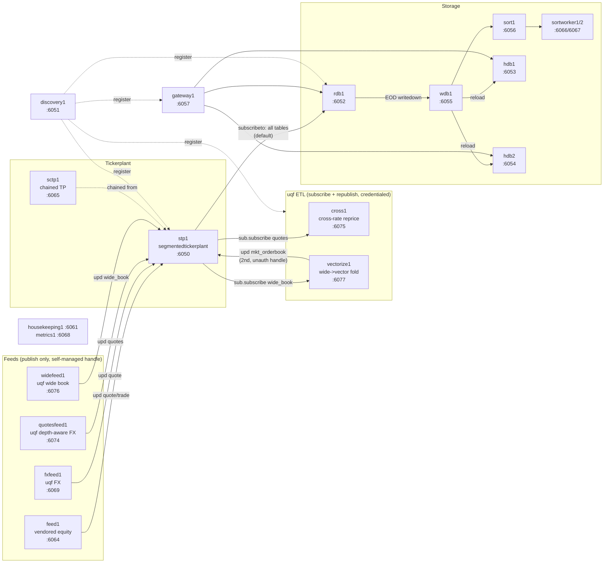
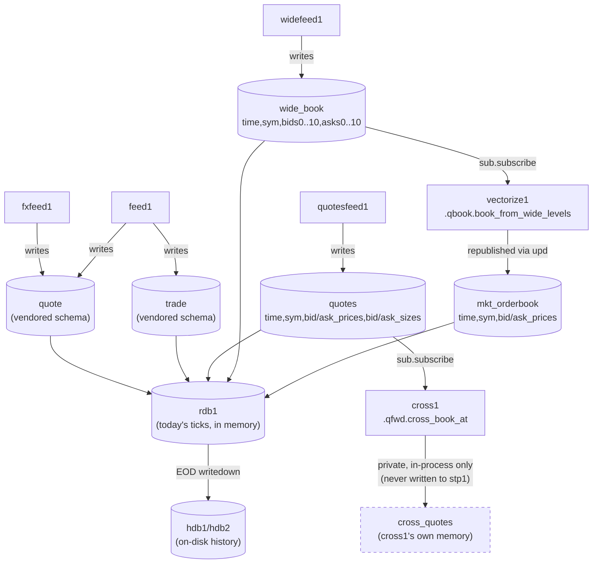
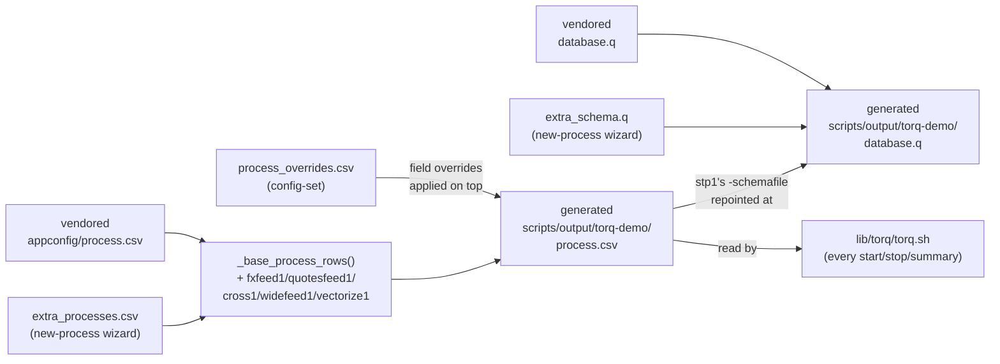

# TorQ demo architecture

Diagrams for the running state of the TorQ Finance Starter Pack demo (see
[docs/torq-demo.md](../torq-demo.md) for how to actually start/stop/query
it). Reflects what `torq-demo list processes` shows today: the vendored
14-process stack plus uqf's own additions (`fxfeed1`, `quotesfeed1`,
`widefeed1`, `cross1`, `vectorize1`).

## Process topology

Who connects to whom over IPC. Solid arrows are `.u.upd` publishes or
`.sub.subscribe` subscriptions (real data flow); dashed arrows are
discovery/registration only.

Two different connection patterns coexist, deliberately:

- **Feeds** (`feed1`/`fxfeed1`/`quotesfeed1`/`widefeed1`) only ever
  *publish*. They find the tickerplant via
  `.servers.gethandlebytype[\`segmentedtickerplant;\`any]` - a
  self-managed handle, no credentials, no `.servers.startup[]`.
- **ETL processes** (`cross1`/`vectorize1`) *subscribe*, which needs a
  real `.servers`-managed, access-listed handle -
  `.servers.startup[]` against `accesslist.txt`. Both borrow the
  already-credentialed `metrics` proctype rather than adding a new
  password file to the vendored tree (see `core.py`'s `add_extra_process`
  comments). `vectorize1` additionally opens a *second*, self-managed
  publish handle (same kind feeds use) to republish its output - one
  process, two connection styles, for two different jobs.

## Data pipeline: table by table

What each process actually reads and writes, and where the two uqf ETL
processes diverge - one publishes its output back onto the tickerplant
(a real, persisted table), the other keeps it private to the process.

`cross_quotes` is drawn dashed because it never becomes a real database
table - it's `.cross.cross_quotes`, a plain in-memory table inside
`cross1`'s own process, queryable only by connecting to `cross1` directly
(`torq-demo query "select from cross_quotes" --port 6075`). `mkt_orderbook`
is a full round trip instead: `vectorize1` folds `wide_book` and republishes
onto `stp1`, so it flows through `rdb1`/`wdb1`/`hdb` exactly like any
vendored table and survives past `vectorize1` restarting.

## Config generation: never edit the vendored tree

Every process/table addition here (`fxfeed1` through `vectorize1`, and
anything the `new-process` wizard adds) follows the same rule: read the
vendored file fresh, generate an extended copy, point the real process at
the copy - the vendored `lib/torq-finance-starter-pack/appconfig/process.csv`
and `database.q` are never written to.

`bootstrap()` (`python/torq_orchestrator/src/torq_orchestrator/core.py`)
regenerates both files on every command - `start`, `stop`, `summary`,
everything - so nothing here is a one-time setup step; the generated
files are always a fresh function of the vendored tree plus whatever's
in the three small, git-tracked extension files.
